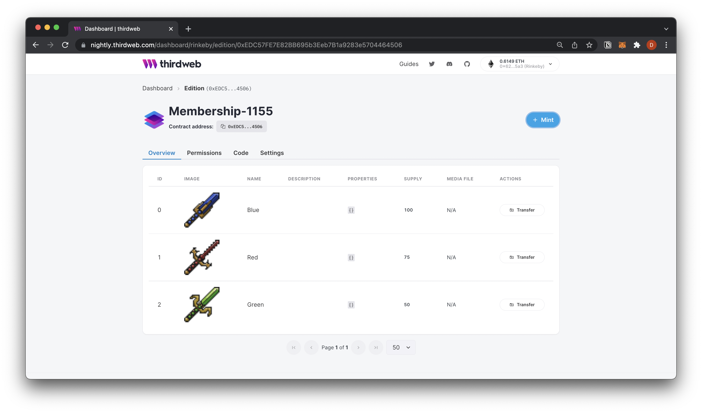
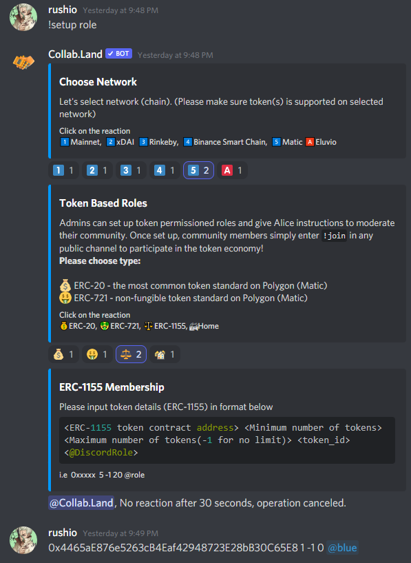

# Create NFT memberships for your Discord

Use NFTs to grant exclusive access into specific Discord servers or channels.

<!-- truncate -->

You can use any of [NFT Contracts](/pre-built-contracts) to grant exclusive access to a Discord server or secret channels within a server.

## Setup NFT (if you don't have one)

1. Go to [https://thirdweb.com/dashboard](https://thirdweb.com/dashboard), connect your wallet and click **Deploy new contract**
2. Select [Edition](/pre-built-contracts/edition) from the prebuilt contracts section and click **Deploy now**
3. Add the metadata of your contract, (image, name, description, royalty fees, etc.). This will be displayed when users view the collection page on Opensea.
4. Click Deploy Now, and confirm the transaction.
5. Click **Mint** on the top right corner to mint your [ERC1155](https://eips.ethereum.org/EIPS/eip-1155) membership NFTs.
6. Add a name and description for your NFT. (This will be displayed when users view the individual NFT page on OpenSea).
7. You can mint multiple NFTs which represent different tiers of membership.
8. Your NFTs have now been minted, and after a few minutes will appear on Opensea under your collection.

## Discord Setup

We'll be using the [collab.land](https://collab.land) Discord bot for this guide.

1. Invite the bot into your server using this [Invite Link](https://discord.com/oauth2/authorize?client_id=704521096837464076&scope=bot&permissions=8).
2. In the **#collabland-config** channel, send the message `!setup role` to set up a role based on NFT ownership.
3. Choose the network which you used to mint your NFT's
4. select ⚖️ for `Edition (ERC1155)`
5. Input the details of the NFT you'd like to grant access to the channel.
   1. `contract address` can be found in your dashboard under your Edition name. It looks like **[0xEDC5...4506]** in the screenshot above.
   2. `token id` can be found at the top of each NFT. It looks like **#0**, **#1**, **#2**, etc.

## 🎊 That's all! NFT holders can now access private channels

When your community member joins the discord, they need to send `!join` to get set up with [collab.land](https://collab.land).
After setting up with the bot, they will be granted roles that unlock access to the chosen channels based on the chosen NFTs in their wallet.
