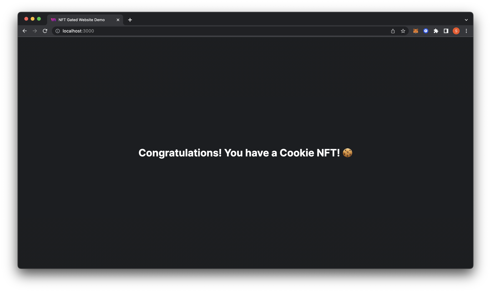

# How to create an NFT-gated website

In this guide, we will create a website that restricts content based on owning an NFT using React.

<!-- truncate -->

One of the more dynamic use cases for NFTs is using them as a membership pass to the NFT holders.
Let’s assume you want to create a website for your community that is only accessible if you have an NFT from
a specific NFT collection.

This way, you could provide exclusive access to downloadable content or hidden pages to NFT holders!

You can grab a copy of the final project from our examples organization, [check it out here](https://github.com/thirdweb-example/NFT-Gated-Website).

## Mint an Edition Drop

To create an NFT gated website, you will need a collection of NFTs, you could use your own, or one of thirdweb's:

- [NFT Collection](/pre-built-contracts/nft-collection)
- [NFT Drop](/pre-built-contracts/nft-drop)
- [Edition](/pre-built-contracts/edition)
- [Edition Drop](/pre-built-contracts/edition-drop)

You can create one using thirdweb’s SDK or thirdweb’s [dashboard](https://thirdweb.com/dashboard).

[Learn more about the differences between our NFT contracts here](https://portal.thirdweb.com/pre-built-contracts/nfts).

In this guide, we use an [Edition Drop](/pre-built-contracts/edition-drop), which allows many NFTs to be created from the same asset, which is perfect for a membership card!

## Using the template repository

To get started, we can use the `create-tw-app` CLI to clone a starter-kit.

```bash
npx thirdweb create --template cra-javascript-starter
```

:::tip
If you’d prefer to use your project, you can install the latest version of our SDK in your project with:

```bash
npm install @thirdweb-dev/sdk @thirdweb-dev/react ethers
```

:::

## Setup the blockchain

Inside our `src` folder, open the `index.js` file and change the `desiredChainId` to the chain of your Edition Drop.

For this project, we’ll be using `Mumbai` since our Edition Drop contract is on the Mumbai testnet.

```jsx title="index.js"
import React from "react";
import { createRoot } from "react-dom/client";
import App from "./App";
import reportWebVitals from "./reportWebVitals";
import { ChainId, ThirdwebProvider } from "@thirdweb-dev/react";

// This is the chainId your dApp will work on.
const activeChainId = ChainId.Mumbai;

const container = document.getElementById("root");
const root = createRoot(container);
root.render(
  <React.StrictMode>
    <ThirdwebProvider desiredChainId={activeChainId}>
      <App />
    </ThirdwebProvider>
  </React.StrictMode>,
);

reportWebVitals();
```

## The connect wallet button

In the same folder, there is the `App.js` file.
In this file, the template has a simple wallet connection page setup.

We have a button that lets users connect with MetaMask, and
when a wallet is connected, it will display the connected wallet address instead!

```jsx title="App.js"
import { useAddress, useMetamask } from "@thirdweb-dev/react";
import "./styles.css";

const App = () => {
  // get address of user & allow them to connect with metamask
  const address = useAddress();
  const connectWithMetamask = useMetamask();

  //if there isn't a wallet connected, display our connect MetaMask button
  if (!address) {
    return (
      <>
        <h1>Welcome to the Cookie Club</h1>
        <button onClick={connectWithMetamask}>Connect MetaMask</button>
      </>
    );
  }

  // if an address is connected, display address
  return (
    <div>
      <p>Your address: {address}</p>
    </div>
  );
};

export default App;
```

Let’s preview what our app looks like and ensure it’s working by running `npm start` in the terminal.

## Conditionally render content & add an NFT minting button

In the same `App.js` file, we will add conditionals that render specific pages based on the connection status of the user.

We want the user to be able to mint an NFT from the drop if they don’t already hold an NFT.
If the connected user does have one, we will display some congratulatory text.

As an extra, I added a helper function to display our shortened wallet address called `truncateAddress`.
Feel free to add or omit this as well in your app.

```jsx title="App.js"
import {
  useAddress,
  useMetamask,
  useEditionDrop,
  useNFTBalance,
} from "@thirdweb-dev/react";
import { useState } from "react";

const App = () => {
  // allow user to connect to app with metamask, and obtain address
  const address = useAddress();
  const connectWithMetamask = useMetamask();

  // Replace this address with your Edition Drop address!
  const editionDrop = useEditionDrop(
    "0x1fCbA150F05Bbe1C9D21d3ab08E35D682a4c41bF",
  );
  const [isClaiming, setIsClaiming] = useState(false);
  const { data: balance, isLoading } = useNFTBalance(editionDrop, address, "0");

  // helper function to truncate the address so it displays in a nice format
  function truncateAddress(address) {
    return `${address.slice(0, 6)}...${address.slice(-4)}`;
  }

  const mintNft = async () => {
    try {
      setIsClaiming(true);
      await editionDrop.claim(0, 1);
    } catch (error) {
      console.error("Failed to mint NFT", error);
    } finally {
      setIsClaiming(false);
    }
  };

  //if there isn't a wallet connected, display our connect MetaMask button
  if (!address) {
    return (
      <div>
        <h1>Welcome to the Shape Club</h1>
        <button onClick={connectWithMetamask}>Connect MetaMask</button>
      </div>
    );
  }

  if (isLoading) {
    return (
      <div className="container">
        <h1>Checking your wallet...</h1>
      </div>
    );
  }

  // if the user is connected and has an NFT from the drop, display text
  if (balance > 0) {
    return (
      <div>
        <h2>Congratulations! You have a Shape Membership Card! 🟦🔺🟣</h2>
      </div>
    );
  }

  // if there are no NFTs from collection in wallet, display button to mint
  return (
    <div>
      <p>
        There are no Shape Membership Card NFTs held by:{" "}
        <span>{truncateAddress(address)}</span>
      </p>
      <button disabled={isClaiming} onClick={mintNft}>
        {isClaiming ? "Claiming..." : "Mint NFT"}
      </button>
    </div>
  );
};

export default App;
```

## Link to Project

You can create a copy of this project from our [example repository.](https://github.com/thirdweb-example/nft-gated-website)

To create a project with all of the code from this guide, you can run:

```bash
npx thirdweb create --template nft-gated-website
```

## Congratulations!

Let’s go! You created an NFT gated membership website using React.

Feel free to add some downloadable content or secret updates behind this new page for your NFT community members!


