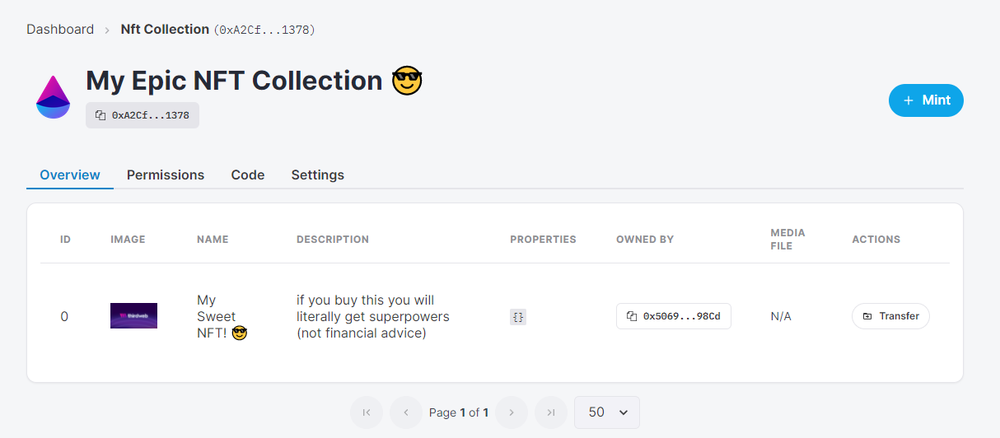
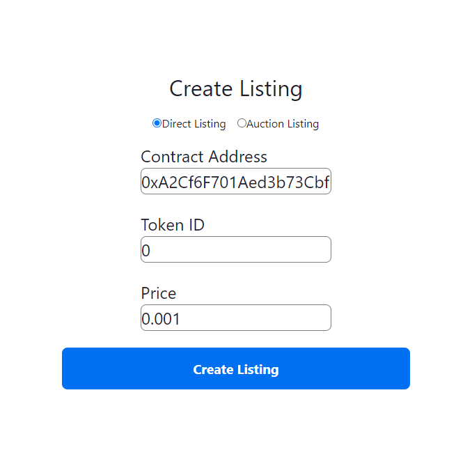
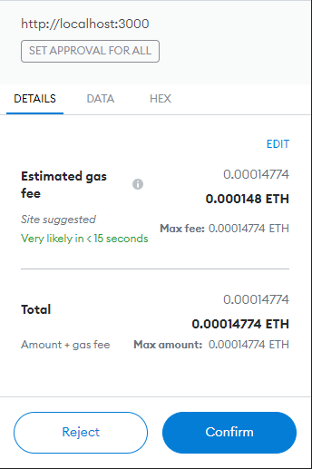

# Marketplace With Next.JS

## Introduction

In this guide, you will learn how to create a marketplace similar to [OpenSea](https://opensea.io/) on the Ethereum test network!

We'll implement the following features:

- A marketplace where we can sell our NFTs!
- List NFTs for **direct sale** or for **auction** onto the marketplace.
- Allow users to **make bids** and **buy** our NFTs.

## Tools

- [**thirdweb Marketplace**](https://portal.thirdweb.com/contracts/marketplace): to facilitate the listing of NFTs and enable users to offer, buy, and sell NFTs on the marketplace.
- [**thirdweb React SDK**](https://docs.thirdweb.com/react): to enable users to connect and disconnect their wallets with our website, and prompt them to approve transactions with MetaMask.
- [**thirdweb TypeScript SDK**](https://docs.thirdweb.com/typescript): to connect to our NFT Collection Smart contract via TypeScript & React hooks, mint new NFTs, create new listings, and view all of the listings for sale!
- [**Next JS Dynamic Routes**](https://nextjs.org/docs/routing/dynamic-routes): so we can have a dynamic route for each listing. eg. `listing/1` will show listing 1.
- [**thirdweb NFT Collection**](https://portal.thirdweb.com/contracts/nft-collection): to create test ERC721 NFTs that we can list onto the marketplace.

## Creating A Marketplace

To create a marketplace contract:

- Head to the [thirdweb dashboard](https://thirdweb.com/dashboard).
- Click **Deploy New Contract**.
- Select **Marketplace** from the list of contracts and click **Deploy Now**.

Select **Marketplace** from the list of contracts and click **Deploy Now**.

Here, you can define the configuration of your marketplace contract, including the name of the marketplace, an image, and a description.


### About the Marketplace Module

The Thirdweb marketplace module supports any [ERC 1155](https://eips.ethereum.org/EIPS/eip-1155) and [ERC 721](https://eips.ethereum.org/EIPS/eip-721) token. If you don't know what those are, you can just think of them as two different types of NFTs.

This is important because it means the marketplace can list any NFT, from any NFT collection. For example, this [NFT of our CEO's face](https://opensea.io/assets/0xc1d4b2e088084beac62a55ac4f956601e0a60dbf/2) could go onto the marketplace.

There are a few conditions that need to be met in order for someone to list an NFT onto the marketplace:

- They must **own** the NFT they're trying to list.
- They must have **permission** to list onto the marketplace (you control this).

Alright, enough talking! Let's write some code!

## Initializing the project

To create your marketplace project, lets head to the command line and run:

```bash
git clone https://github.com/thirdweb-example/next-typescript-starter my-marketplace
```

Next, (no pun intended), change directory into your newly created Next App.

```bash
cd .\my-marketplace\
```

### Dependencies

Thirdweb comes jam-packed with features and libraries that help you build in the languages you know and love.

Let's install them by running:

```
npm install
```

Cool! Now, lets jump into the code by running:

```bash
code .
```

This will open your project up in **Visual Studio Code**.

To get your local environment setup, run:

```bash
npm run dev
```

And visit http://localhost:3000/

## The Thirdweb Provider

The thirdweb React provider makes it straightforward to let your users connect their wallets to your website, and it abstracts away all the boilerplate you would usually have to write.

Open `pages/_app.tsx` and you can notice this is already setup for you:

```jsx
import { ChainId, ThirdwebProvider } from "@thirdweb-dev/react";

// This is the chainId your dApp will work on.
const activeChainId = ChainId.Mainnet;

function MyApp({ Component, pageProps }) {
  return (
    <ThirdwebProvider desiredChainId={activeChainId}>
      <Component {...pageProps} />
    </ThirdwebProvider>
  );
}

export default MyApp;
```

We'll need to change our `activeChainId` to match the network we deployed on, which for us was **Rinkeby**:

```jsx
const activeChainId = ChainId.Rinkeby;
```

If you are curious about the ThirdwebProvider and how its magic works behind the scenes, [we have another great tutorial here](https://portal.thirdweb.com/guides/add-connectwallet-to-your-website) that goes into more depth.

## Signing Users In With Their Wallets

The other thing this starter kit provides is a way for users to sign in with their wallets.

You can see this code on the `pages/index.tsx` file:

```jsx
const address = useAddress();
const connectWithMetamask = useMetamask();
const disconnectWallet = useDisconnect();
return (
  <div>
    {address ? (
      <>
        <button onClick={disconnectWallet}>Disconnect Wallet</button>
        <p>Your address: {address}</p>
      </>
    ) : (
      <button onClick={connectWithMetamask}>Connect with Metamask</button>
    )}
  </div>
);
```

That's a basic homepage already. It doesn't let a user do much besides connecting their wallet, but it's a good base for any other project you might have in mind.

## Displaying Listings On The Marketplace

Now we can sign users in, let's show them what we have for sale.

To do that, we'll use another hook, called `useMarketplace` to grab our marketplace smart contract.

Then, we'll use the `useActiveListings` hook, which grabs all of the listings on the smart contract that haven't expired or already sold.

Here's how that looks in code:

### Getting all active listings

```jsx
import Link from "next/link";
import {
  MediaRenderer,
  useActiveListings,
  useMarketplace,
} from "@thirdweb-dev/react";
import { useRouter } from "next/router";

const Home = () => {
  // Connect your marketplace smart contract here (replace this address)
  const marketplace = useMarketplace(
    "0x277C0FB19FeD09c785448B8d3a80a78e7A9B8952", // Your marketplace contract address here
  );

  const { data: listings, isLoading: loadingListings } =
    useActiveListings(marketplace);

  return <div></div>;
};

export default Home;
```

Cool, now that we have all of the active listings, let show them in the UI:

**Displaying listings:**

```jsx
return (
  <div>
    {
      // If the listings are loading, show a loading message
      loadingListings ? (
        <div>Loading listings...</div>
      ) : (
        // Otherwise, show the listings
        <div>
          {listings?.map((listing) => (
            <div
              key={listing.id}
              onClick={() => router.push(`/listing/${listing.id}`)}
            >
              <MediaRenderer src={listing.asset.image} />
              <h2>
                <Link href={`/listing/${listing.id}`}>
                  <a>{listing.asset.name}</a>
                </Link>
              </h2>

              <p>
                <b>{listing.buyoutCurrencyValuePerToken.displayValue}</b>{" "}
                {listing.buyoutCurrencyValuePerToken.symbol}
              </p>
            </div>
          ))}
        </div>
      )
    }
  </div>
);
```

## Creating Listings

Now we are done with the home page, lets create some listings to display!

In this guide, we'll also quickly go through the process of creating an NFT Collection, so that we can play around with some NFTs on the marketplace!

If you already have NFTs that you can play around with on the Rinkeby network, feel free to use those instead and skip this optional step.

## (Optional) Creating An NFT Collection

Head back to the [dashboard](https://thirdweb.com/dashboard) and create a new **NFT Collection** contract.

Configure your NFT Collection to your liking, and deploy it onto the Rinkeby test network.

Now, let's go ahead and mint our very own NFT via the UI!

To do that, while you're in the NFT Collection, click the **Mint** button.

Create your awesome NFTs and click **Mint NFT**!

Here's how it should look:



Great work, now let's head back to the marketplace guide.

## Listing Items on the marketplace

Head back to your code and create a page in the `pages` folder called `create.tsx`.

There's a few bits of code to unpack here that we'll go through step by step.

Firstly, let's import all of the stuff we'll need to use on this page:

```jsx
import {
  useMarketplace,
  useNetwork,
  useNetworkMismatch,
} from "@thirdweb-dev/react";
import { NATIVE_TOKEN_ADDRESS } from "@thirdweb-dev/sdk";
import { useRouter } from "next/router";
```

Next, let's create a function that handles creating a listing.

Before we dive into the code for that, it's important to know that there are two different types of listings in thirdweb.

1. Auction Listings
2. Direct Listings

**Auction Listings**: listings that have a set time period that users can bid. At the end of the time period, the auction will end, and the winning bid will win the auction.

**Direct Listings**: listings that only finish if the seller decides to accept an offer, or if somebody pays the full price of the listing, or if the listing end date is reached.

Both listing types allow potential buyers to place bids or buyout the listing by paying the full asking price (AKA Buyout Price).

Alright, with that background information, lets create some functions to list an item onto the marketplace, plus a little extra within the `create.tsx` page.

**Declaring our page and adding some useful hooks**

```jsx
const Create = () => {
  // Next JS Router hook to redirect to other pages
  const router = useRouter();

  // Connect to our marketplace contract via the useMarketplace hook
  const marketplace = useMarketplace(
    "0x0000000000000000000000000000", // Your address here
  );
  const networkMismatch = useNetworkMismatch();
  const [, switchNetwork] = useNetwork();

  return <div></div>;
};

export default Create;
```

**Function that gets run when the form is submitted**

```jsx
// This function gets called when the form is submitted.
// The user has provided:
// - contract address
// - token id
// - type of listing (either auction or direct)
// - price of the NFT
// This function gets called when the form is submitted.
async function handleCreateListing(e: any) {
  try {
    // Ensure user is on the correct network
    if (networkMismatch) {
      switchNetwork && switchNetwork(4); // 4 is rinkeby here
      return;
    }

    // Prevent page from refreshing
    e.preventDefault();

    // Store the result of either the direct listing creation or the auction listing creation
    let transactionResult = undefined;

    // De-construct data from form submission
    const { listingType, contractAddress, tokenId, price } = e.target.elements;

    // Depending on the type of listing selected, call the appropriate function
    // For Direct Listings:
    if (listingType.value === "directListing") {
      transactionResult = await createDirectListing(
        contractAddress.value,
        tokenId.value,
        price.value,
      );
    }

    // For Auction Listings:
    if (listingType.value === "auctionListing") {
      transactionResult = await createAuctionListing(
        contractAddress.value,
        tokenId.value,
        price.value,
      );
    }

    // If the transaction succeeds, take the user back to the homepage to view their listing!
    if (transactionResult) {
      router.push(`/`);
    }
  } catch (error) {
    console.error(error);
  }
}
```

**Create Auction Type Listing**

```jsx
async function createAuctionListing(
  contractAddress: string,
  tokenId: string,
  price: string,
) {
  try {
    const transaction = await marketplace?.auction.createListing({
      assetContractAddress: contractAddress, // Contract Address of the NFT
      buyoutPricePerToken: price, // Maximum price, the auction will end immediately if a user pays this price.
      currencyContractAddress: NATIVE_TOKEN_ADDRESS, // NATIVE_TOKEN_ADDRESS is the crpyto curency that is native to the network. i.e. Rinkeby ETH.
      listingDurationInSeconds: 60 * 60 * 24 * 7, // When the auction will be closed and no longer accept bids (1 Week)
      quantity: 1, // How many of the NFTs are being listed (useful for ERC 1155 tokens)
      reservePricePerToken: 0, // Minimum price, users cannot bid below this amount
      startTimestamp: new Date(), // When the listing will start
      tokenId: tokenId, // Token ID of the NFT.
    });

    return transaction;
  } catch (error) {
    console.error(error);
  }
}
```

**Create Direct Type Listing**

```ts
async function createDirectListing(
  contractAddress: string,
  tokenId: string,
  price: string,
) {
  try {
    const transaction = await marketplace?.direct.createListing({
      assetContractAddress: contractAddress, // Contract Address of the NFT
      buyoutPricePerToken: price, // Maximum price, the auction will end immediately if a user pays this price.
      currencyContractAddress: NATIVE_TOKEN_ADDRESS, // NATIVE_TOKEN_ADDRESS is the crpyto curency that is native to the network. i.e. Rinkeby ETH.
      listingDurationInSeconds: 60 * 60 * 24 * 7, // When the auction will be closed and no longer accept bids (1 Week)
      quantity: 1, // How many of the NFTs are being listed (useful for ERC 1155 tokens)
      startTimestamp: new Date(0), // When the listing will start
      tokenId: tokenId, // Token ID of the NFT.
    });

    return transaction;
  } catch (error) {
    console.error(error);
  }
}
```

**Render a form where users can write the NFT they want to list into**

```ts
return (
  <form onSubmit={(e) => handleCreateListing(e)}>
    <div>
      {/* Form Section */}
      <div>
        <h1>Upload your NFT to the marketplace:</h1>

        {/* Toggle between direct listing and auction listing */}
        <div>
          <input
            type="radio"
            name="listingType"
            id="directListing"
            value="directListing"
            defaultChecked
          />
          <input
            type="radio"
            name="listingType"
            id="auctionListing"
            value="auctionListing"
          />
        </div>

        {/* NFT Contract Address Field */}
        <input
          type="text"
          name="contractAddress"
          placeholder="NFT Contract Address"
        />

        {/* NFT Token ID Field */}
        <input type="text" name="tokenId" placeholder="NFT Token ID" />

        {/* Sale Price For Listing Field */}
        <input type="text" name="price" placeholder="Sale Price" />

        <button type="submit">Create Listing</button>
      </div>
    </div>
  </form>
);
```

Now, let's go ahead and list our NFT that we created inside our NFT Collection.

First, let's copy the NFT's contract address via the thirdweb dashboard and also note it's tokenId (which should be `0` assuming its the first one you made in the collection).

Let's fill out our form with the NFT information, like so:



Click **Create Listing**!



You'll be asked for two transactions:

1. Approve the marketplace to sell your NFTs while the NFT still lives in your wallet. (`setApprovalForAll`)
2. Create the listing on the marketplace.

If everything worked as planned, after you approve these two transactions, you should now see the listing you just created on the home page!

Nice 😎

## Viewing A Listing

On the home page, we provide a `Link` on each listing's name to a URL that looks like: `/listing/${listing.id}`.

This is using [Next JS's Dynamic Routes](https://nextjs.org/docs/routing/dynamic-routes).

This route will be used to display any listing in detail, and we'll use this page to show some buttons where users can **buy **or **place a bid ** on the listing.

The way that dynamic routes work in Next.JS is that you create a folder inside the pages folder, called `listing`, and within that folder, create a `[listingId].tsx` file.

Now, whenever a user visits the route `/listing/<listing id here>`, we show them the appropriate listing page, by performing some logic inside this component to fetch the listing by it's `id`. Let's see how that looks in code.

```jsx
import {
  useMarketplace,
  useNetwork,
  useNetworkMismatch,
} from "@thirdweb-dev/react";
import {
  ChainId,
  ListingType,
  NATIVE_TOKENS,
} from "@thirdweb-dev/sdk";
import { useRouter } from "next/router";
import { useEffect, useState } from "react";

const ListingPage: NextPage = () => {
  // Next JS Router hook to redirect to other pages and to grab the query from the URL (listingId)
  const router = useRouter();

  // De-construct listingId out of the router.query.
  // This means that if the user visits /listing/0 then the listingId will be 0.
  // If the user visits /listing/1 then the listingId will be 1.
  // We do some weird TypeScript casting, because Next.JS thinks listingId can be an array for some reason.
  const { listingId } = router.query as { listingId: string };

  return <></>;
};

export default ListingPage;
```

Alright now lets add some code to fetch the listing, and some basic UI to show the listing in detail!

There's a few parts to it, so let's break it down again. Here's the source code.

**Fetching The Listing**

```jsx
// Loading flag for the UI, so we can show a loading state while we wait for the data to load.
const [loadingListing, setLoadingListing] = useState(true);

// Store the bid amount the user entered into the bidding textbox
const [bidAmount, setBidAmount] = useState("");

// Storing this listing in a state variable so we can use it in the UI once it's fetched.
const [listing, setListing] = useState();

// Initialize the marketplace contract
const marketplace = useMarketplace(
  "0x90AC8dFF76C1692dD494e261dac5D0f6684B0674",
);

// When the component mounts, ask the marketplace for the listing with the given listingId
// Using the listingid from the URL (via router.query)
useEffect(() => {
  if (!listingId || !marketplace) {
    return;
  }
  (async () => {
    // Pass the listingId into the getListing function to get the listing with the given listingId
    const l = await marketplace.getListing(listingId);

    // Update state accordingly
    setLoadingListing(false);
    setListing(l);
  })();
}, [listingId, marketplace]);
```

**Displaying Listing Information on the UI**

```jsx
if (loadingListing) {
  return <div>Loading...</div>;
}

if (!listing) {
  return <div>Listing not found</div>;
}

return (
  <div>
    
    <h1>{listing.asset.name}</h1>
    <p>
      <b>Description:</b> {listing.asset.description}
    </p>
    <p>
      <b>Seller:</b> {listing.sellerAddress}
    </p>
    <p>
      <b>Listing Type:</b>{" "}
      {listing.type === 0 ? "Direct Listing" : "Auction Listing"}
    </p>

    <p>
      <b>Buyout Price</b> {listing.buyoutCurrencyValuePerToken.displayValue}{" "}
      {listing.buyoutCurrencyValuePerToken.symbol}
    </p>

    <div>
      <div>
        <input
          type="text"
          placeholder="Enter bid amount"
          value={bidAmount}
          onChange={(e) => setBidAmount(e.target.value)}
        />

        <button>Make Bid</button>
      </div>

      <button>Buy Now</button>
    </div>
  </div>
);
```

## Making Bids / Making Offers

In thirdweb, making offers below the asking price of a listing has different behaviour, depending on whether the listing is an **auction **or a **direct **listing.

### Bids

**Bids** are made on **Auction Listings**. Bids have a few unique characteristics, they:

- Bids cannot be cancelled once they've been made.
- Automatically get refunded when somebody makes a higher bid on the same listing.
- Bids must be made in the currency that the listing was created with. On ETH marketplaces, bids are placed in wETH. (Wrapped ETH)

### Offers

**Offers** are made on **Direct Listings**. Offers are different from bids in a few ways:

- Offers can be made in any currency.
- Multiple offers can exist at the same time on one listing, unlike bids.
- Offers can be cancelled at any time

Hopefully that clarifies the difference between the two.

Now let's start writing some code to enable users to make bids and make offers!

### The Code

**Creating A Bid / Offer**

```jsx
async function createBidOrOffer() {
  try {
    // Ensure user is on the correct network
    if (networkMismatch) {
      switchNetwork && switchNetwork(4);
      return;
    }

    // If the listing type is a direct listing, then we can create an offer.
    if (listing?.type === ListingType.Direct) {
      await marketplace?.direct.makeOffer(
        listingId, // The listingId of the listing we want to make an offer for
        1, // Quantity = 1
        NATIVE_TOKENS[ChainId.Rinkeby].wrapped.address, // Wrapped Ether address on Rinkeby
        bidAmount, // The offer amount the user entered
      );
    }

    // If the listing type is an auction listing, then we can create a bid.
    if (listing?.type === ListingType.Auction) {
      await marketplace?.auction.makeBid(listingId, bidAmount);
    }

    alert(
      `${
        listing?.type === ListingType.Auction ? "Bid" : "Offer"
      } created successfully!`,
    );
  } catch (error) {
    console.error(error);
    alert(error);
  }
}
```

**Buying the NFT**

```jsx
async function buyNft() {
  try {
    // Ensure user is on the correct network
    if (networkMismatch) {
      switchNetwork && switchNetwork(4);
      return;
    }

    // Simple one-liner for buying the NFT
    await marketplace?.buyoutListing(listingId, 1);
    alert("NFT bought successfully!");
  } catch (error) {
    console.error(error);
    alert(error);
  }
}
```

Now let's attach these functions to their respective buttons that we created:

```jsx
<div>
  <button onClick={buyNft}>Buy</button>
  <div>
    <input
      type="text"
      name="bidAmount"
      onChange={(e) => setBidAmount(e.target.value)}
      placeholder="Amount"
    />
    <button onClick={createBidOrOffer}>Make Offer</button>
  </div>
</div>
```

Great work! Now let's try it out!

To test that it works as you expect, feel free to create a new wallet, so that you know for sure that the funds and NFTs are being exchanged between the two wallets.

As we mentioned briefly, in order to make bids, we'll need some Rinkeby wETH, which is the ERC20 token Wrapped Ether.

Let's try it out, and click on our `Buy` button! This will pay the full price for the NFT, and once you accept the transaction request, head back to the homepage, and you'll notice the listing is no longer displayed!

**Magic!**

The wallet that bought the NFT now owns the token, the listing has been closed, and the funds have been transferred to the seller.

If you check out the NFT Module you created (if you created one), you can see that it is now owned by the buyer in there!

## Conclusion

The thirdweb marketplace takes the heavy lifting out of your full stack development process.
Our engineering experts have designed the smart contracts with security and safety in mind, enabling you to focus on shipping 🚢!

In this guide, we've successfully:

- Built a full-stack NFT marketplace project.
- Created direct and auction listings with NFTs we minted.
- Received bids and sold our NFTs via the marketplace!

## Join our Discord!

For any questions, suggestions, join our discord at [https://discord.gg/thirdweb](https://discord.gg/thirdweb).
