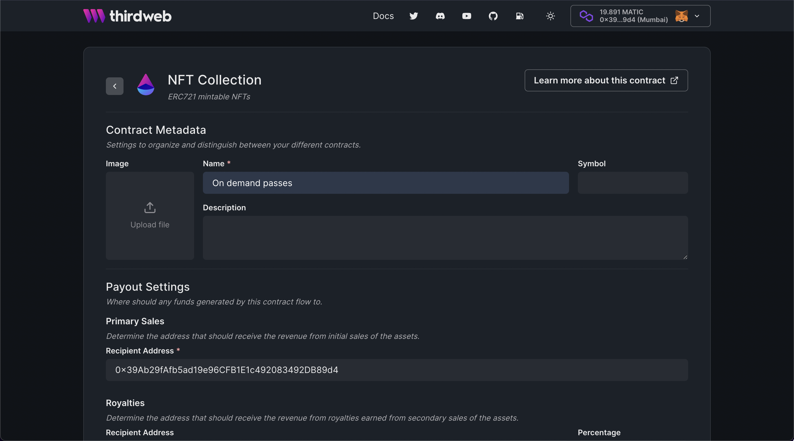
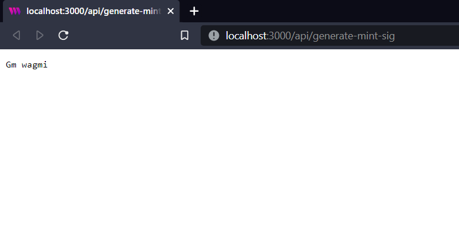

import QuickstartCard from "../../src/components/QuickstartCard";

# Create on demand access pass minting (ERC 721)

Learn how to create an NFT collection of passes that will be minted on demand using signature minting!

<!-- truncate -->

## Introduction

In this guide, we are going to create a [NFT collection](/pre-built-contracts/nft-collection) where users
will be able to connect their wallets to the website and mint an NFT by generating a signature. The metadata of the signature will be the same for everyone but this will help us send ERC 721 tokens which are unique to all the users.

This collection of passes will be similar to the [Fnatic passes drop](https://opensea.io/collection/fnatic-citizen)!

Before we get started, below are some helpful resources where you can learn more about the tools we're going to be using in this guide.

<div className="row" style={{marginBottom:24}}>
<div className="col col--6" style={{ marginTop: 8 }}>
  <QuickstartCard
    name="View Project Source Code"
    link="https://github.com/thirdweb-dev/examples/tree/main/typescript/on-demand-pass"
    image="/assets/icons/general.png"
    openInNewTab
  />
</div>

<div className="col col--6" style={{ marginTop: 8 }}>
  <QuickstartCard
    name="NFT Collection Contract"
    link="/pre-built-contracts/nft-collection"
    image="/assets/icons/nft.png"
    openInNewTab
  />
</div>
</div>

Let's get started.

## Setup

I am going to use the [Next typescript starter template](https://github.com/thirdweb-example/next-typescript-starter) for this guide.

If you are following along with the guide, you can create a project with the
[Next TypeScript template](https://github.com/thirdweb-example/next-typescript-starter) using the [thirdweb CLI](/thirdweb-cli):

```bash
npx thirdweb create --next --ts
```

If you already have a Next.js app you can simply follow these steps to get started:

- Install `@thirdweb-dev/react` and `@thirdweb-dev/sdk` and `ethers`
- Add MetaMask authentication to the site. You can follow this [guide](/guides/add-connectwallet-to-your-website) to do this.

By default the network in `_app.tsx` is Mainnet, we need to change it to Mumbai

```tsx title="_app.tsx"
import type { AppProps } from "next/app";
import { ChainId, ThirdwebProvider } from "@thirdweb-dev/react";

// This is the chainId your dApp will work on.
const activeChainId = ChainId.Mumbai;

function MyApp({ Component, pageProps }: AppProps) {
  return (
    <ThirdwebProvider desiredChainId={activeChainId}>
      <Component {...pageProps} />
    </ThirdwebProvider>
  );
}

export default MyApp;
```

## Creating an NFT collection

We also need to create an NFT collection contract where all the passes will live.
So, go to the [thirdweb dashboard](https://thirdweb.com/dashboard) and create an NFT collection!

Fill out the details and deploy the contract!



We don't need to do anything else for now, all the NFTs will be minted as the users start minting! So let's get started with the code.

## Making the website

### Creating an API for generating a signature

We are going to use the signature minting on our backend. You can also add different checks if you want like different price for different wallets, allowing users to mint only 1 pass, etc.

Create a new folder `api` in the pages folder and `generate-mint-sig.ts` inside it.

We will now build a basic API that will output "gm wagmi"

```ts title="api/generate-mint-sig.ts"
import type { NextApiRequest, NextApiResponse } from "next";

const generateMintSignature = async (
  req: NextApiRequest,
  res: NextApiResponse,
) => {
  res.send("gm wagmi");
};

export default generateMintSignature;
```

This creates a basic API for us, if you now go to the [`api/generate-mint-sig`](http://localhost:3000/api/generate-mint-sig)
endpoint, you will get a response of `gm wagmi`.



Let's now initialize the [thirdweb SDK](/building-web3-apps/setting-up-the-sdk)!

```ts title="api/generate-mint-sig.ts"
const sdk = ThirdwebSDK.fromPrivateKey(
  process.env.PRIVATE_KEY as string,
  "mumbai",
);
```

As you can see, we are using an environment variable to initialize the sdk.
The variable is called `PRIVATE_KEY` which is the private key of the wallet.
Create a new file `.env.local` and add your private key.

```bash title=".env.local"
PRIVATE_KEY=<private_key>
```

:::info How to export your private key

Learn how to [export your private key](/guides/create-a-metamask-wallet#export-your-private-key) from your wallet.

:::

To do this, create a file called `.env.local` at the root of your project, and add the following to it:

```
PRIVATE_KEY=your-private-key-here
```

:::warning

Ensure you store and access your private key securely.

- **Never** commit any file that may contain your private key to your source control.

:::

We also need to import the `ThirdwebSDK`:

```tsx
import { ThirdwebSDK } from "@thirdweb-dev/sdk";
```

**Generating the signature**
Finally, we are going to access the NFT Collection using the sdk and generate a signature from it:

```ts title="api/generate-mint-sig.ts"
const { address } = JSON.parse(req.body);

const collection = sdk.getNFTCollection(
  "0xeED8165505d78D2CA9f2b4fA6Aff179CeBd4dCA4",
);

const metadata = {
  name: "Test title",
  description: "Test description",
  image:
    "https://images.unsplash.com/photo-1658309833607-4de9956d0bbd?ixlib=rb-1.2.1&ixid=MnwxMjA3fDB8MHxwaG90by1wYWdlfHx8fGVufDB8fHx8&auto=format&fit=crop&w=1064&q=80",
  properties: {
    type: "test",
  },
};

try {
  const signedPayload = await collection.signature.generate({
    to: address,
    metadata,
  });

  return res.status(200).json({
    signedPayload: signedPayload,
  });
} catch (error) {
  console.log(error);
  return res.status(500).json({
    error,
  });
}
```

This is an example of a free mint, you can pass in different properties like price to customize your NFT collection! And as you can see we have created a new metadata object with data of the pass so you need to change the details like name, image, description, and properties based on your needs!

### Calling the API from the frontend

In `index.tsx` update the address ternary and add the Mint button:

```tsx title="index.tsx"
<div>
  {address ? (
    <button onClick={mint}>Mint</button>
  ) : (
    <button onClick={connectWithMetamask}>Connect with Metamask</button>
  )}
</div>
```

Now we will create the mint function that makes an api call to the backend and mints the NFT:

```tsx title="index.tsx"
const collection = useNFTCollection(
  "0xeED8165505d78D2CA9f2b4fA6Aff179CeBd4dCA4",
);

const mint = async () => {
  const signedPayloadReq = await fetch("/api/generate-mint-sig", {
    method: "POST",
    body: JSON.stringify({ address }),
  });

  const signedPayload = await signedPayloadReq.json();

  try {
    const nft = await collection?.signature.mint(signedPayload.signedPayload);
    return nft;
  } catch (err) {
    console.error(err);
    return null;
  }
};
```

If we now try minting the NFT, we will be able to mint the NFT successfully!
