# Deploy a randomized NFT drop without writing any code

Learn how to randomize your NFT drop with no-code.

<!-- truncate -->

## Intro

Let’s say you are ready to launch your first NFT project but you want it to be randomized for your community to mint. This is possible without writing any code by just using the thirdweb dashboard.

In this guide, we’ll [deploy a collection using the NFT drop contract](https://portal.thirdweb.com/guides/release-an-nft-drop-with-no-code), then we’ll shuffle the metadata arrangement and **batch upload** it to the dashboard to make the order completely random.

Keep in mind that we are shuffling the arrangement of the metadata only not the token ID of your NFT. So your NFT number would be different from your token ID when we upload it to the dashboard. If that’s good with you let’s start the hack!

## Setup

### Create a contract

Let’s assume you’ve already a MetaMask wallet, if not please follow our [create a MetaMask wallet tutorial](https://portal.thirdweb.com/guides/create-a-metamask-wallet). We’re going to use Polygon Testnet Mumbai for this guide instead of using Mainnets (Ethereum, Polygon, Fantom, Avalanche, etc...). We’ll be needing some test balance for the Mumbai Testnet, please follow our tutorial on [how to get Matic on Polygon Mumbai Testnets](https://portal.thirdweb.com/guides/get-matic-on-polygon-mumbai-testnet-faucet). Lastly, the image assets to use! Feel free to use the same images I use for this guide, you can [download the image assets here](./random_eyes_assets.zip).

Now, let’s head over to the [thirdweb dashboard](https://thirdweb.com/dashboard) and click **deploy new contract**.

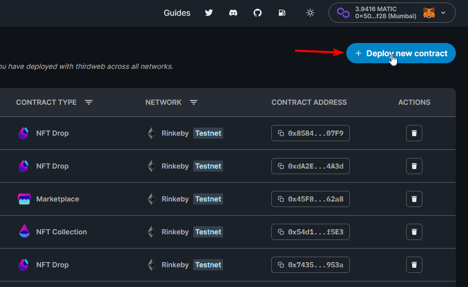

After that, scroll down to **Built-in Contracts** section and look for **NFT drop** and click the **Deploy Now** button.

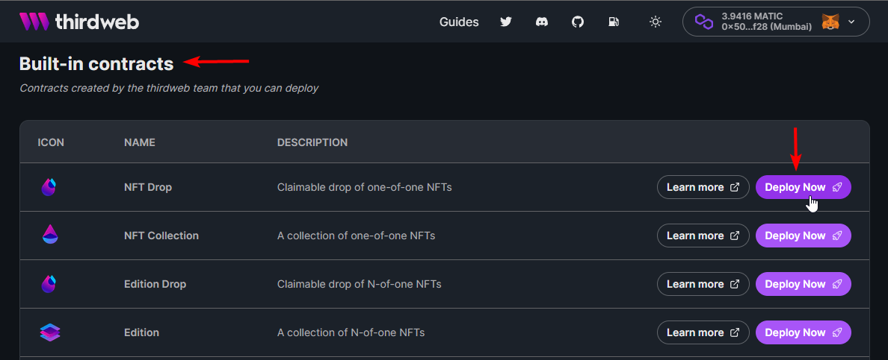

A contract form will show, here’s my **NFT drop contract** information, fill it up with your own information. For this guide, I’ll keep the percentage **as is** but you can put whatever you want value. The ideal for me would be 5% but still, it’s up to you. After that, click **Deploy Now** and **confirm the transaction**.

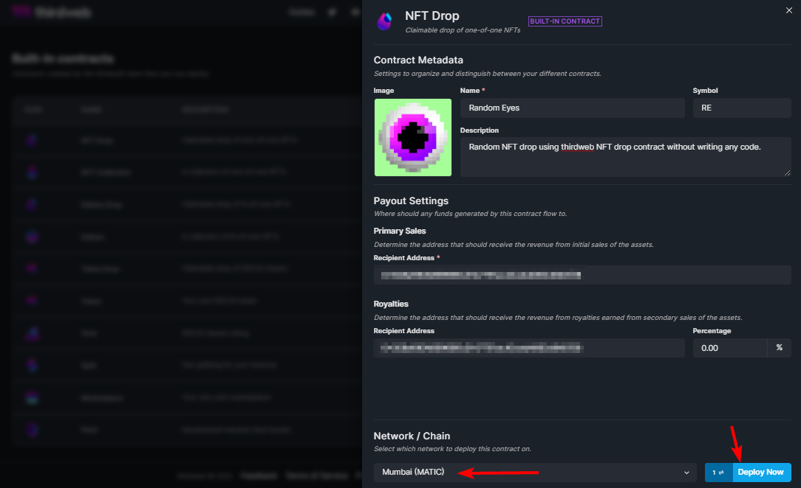

:::caution Keep in Mind!

You can't update or modify the token symbol once you deployed the contract.

:::

Once the transaction has been confirmed you will see the dashboard of your NFT drop contract and see something like this below.

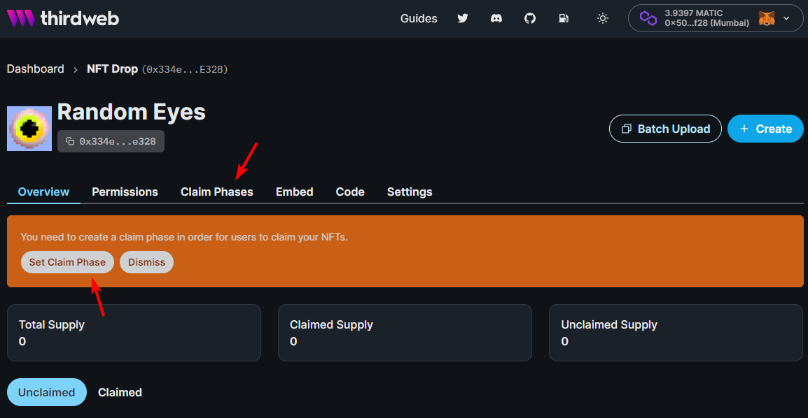

You will need to set up your contract’s claim phases before we proceed to the next step. In this guide, I will not cover this, feel free to learn more about how to [create nft drop with claim phases here](https://portal.thirdweb.com/guides/create-nft-drop-with-claim-phases).

## Randomize the Metadata

Here’s the exciting part of this guide, we will learn how to shuffle the NFT’s order in the metadata file to make it random before we upload it to the thirdweb dashboard. The thirdweb’s **batch upload** for drops contract supports two file formats for NFT metadata which are **CSV** and **JSON**.

We’ll cover both file formats in this guide, feel free to skip to the file format you have right now, for now, let’s start with the easiest format which is the **CSV** file. After this, we can go to the **JSON** file.

### Randomize CSV file

Randomizing NFT data in a **CSV** file is pretty easy and straightforward. We are going to use Google Sheets for this guide for the reason it is easy for me to share it and we are going to use some of the features from Google Sheets that might not be present in other spreadsheet programs.

You can get my [sample NFT data here](https://docs.google.com/spreadsheets/d/1ulejwwTQDcpmG01QD8x6IEhoyMU_VTd3dUzDCvcqioA/edit?usp=sharing), download it, or copy-paste it to your own sheet.

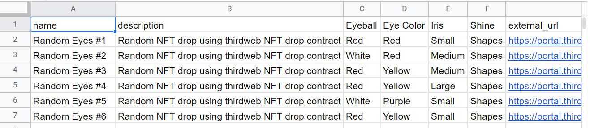

As you can see we are using typical metadata for our NFT drop, nothing special. Until we shuffle it, but before we shuffle it, how about the images associated with each NFT data? We’re gonna add them to each row using the `image` column.

First, create a new column and name it `image`, next add a few numbers below it. Match the number with your NFT number, for example below.

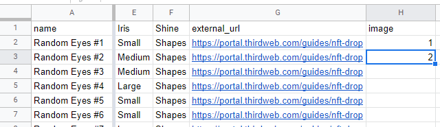

Let’s use the **fill handle** to auto-fill the empty cells.

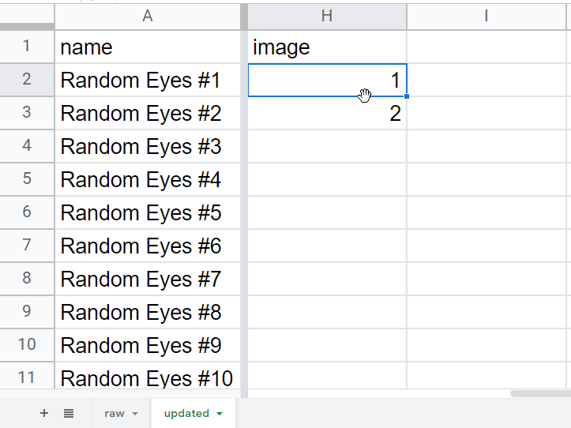

The `image` column is for the actual file name of your image assets. For example, if your image file asset named as `0.png` or `1.jpg` then that would you need to input as value under `image` column.

:::tip The Idea!

We only need to add a file extension name to each number in the `image` column so that we can map the image locally.

`<number> + <suffix file extension name>` or `1 + .png`

:::

Luckily, Google Sheets has a formula for this. It is useful if you have a 10k+ collection.

To do this, get the **cell range** of the `image` column starting from the first value.


In my case it’s `H2:H26`, it is important to get the cell range because we are going to write some smart fill formula. Now place your **active cell** next to the `image` column on the second row like this.

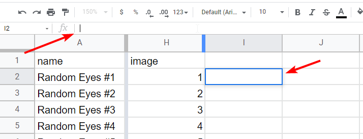

Place your cursor to the **formula bar** and let’s write the formula for populating the file extension name of the associated image asset to each NFT data. Use the following formula and replace it with your **cell range**.

```
=ARRAYFORMULA(<cell:range> & ".png")
``` 

:::note

Make sure to change the `.png` with your actual file extension name. It can be `.jpg`, `.jpeg`, etc.

:::

Input this to the **formula bar** and hit enter! It should automatically fill out the rest of the metadata. After that, copy the extra column that has the generated values and use that to replace the row values under the `image` column by pressing `CTRL+SHIFT+V` for Windows or `⌘+SHIFT+V` for MacOs. You can follow the steps below!

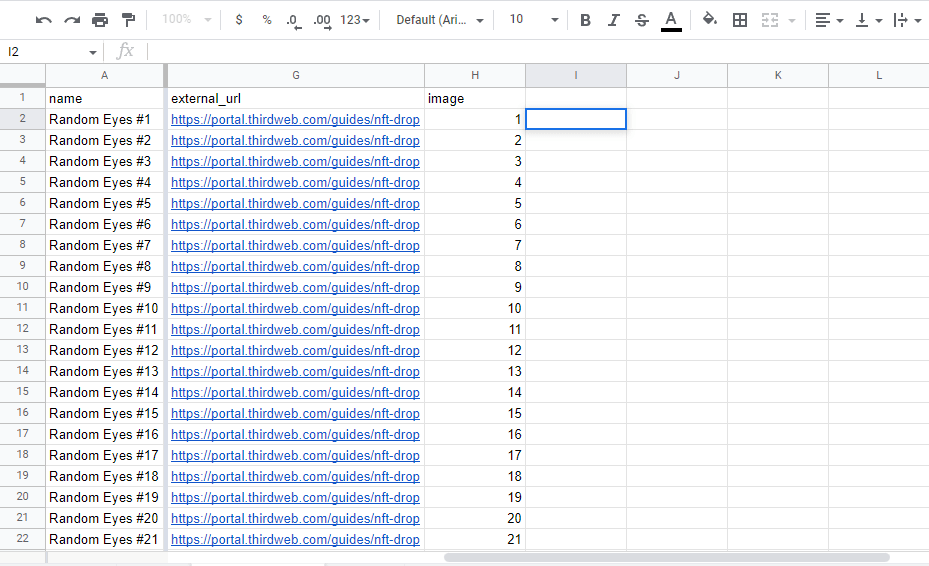

Let’s start randomizing the rows! Select the second row and press `CTRL+SHIFT+Arrow Down` in Windows or `⌘+SHIFT+Arrow Down` in MacOS. This will select all of the rows in your metadata, next click the **Data** menu, and from there click the **Randomize range**. Repeat this step until you are satisfied.

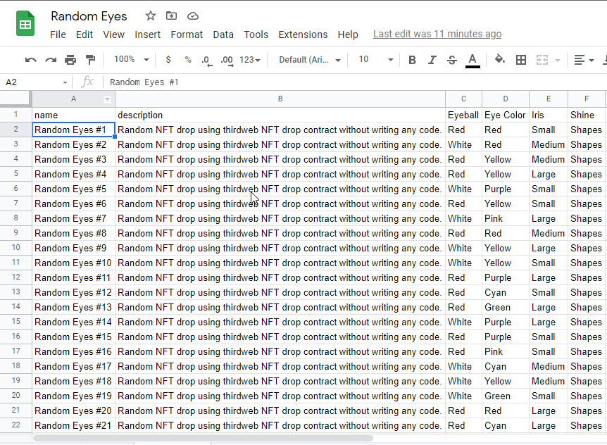

You can now [download it](https://docs.google.com/spreadsheets/d/1ulejwwTQDcpmG01QD8x6IEhoyMU_VTd3dUzDCvcqioA/edit#gid=231077610), click the **File** menu navigate to **Download**, and select **CSV**. We can now use it to upload to the thirdweb dashboard. 👏

### Randomize JSON file

When it comes to randomizing the NFT data in a JSON file, it should be easy. Before we shuffle the metadata make sure to update your image base URI using your art generator. There should be a setting or a way to update your generated metadata.

For example, if you’re using Hashlips Art Engine, open the config.js and look for baseURI and update it with just a dot only.

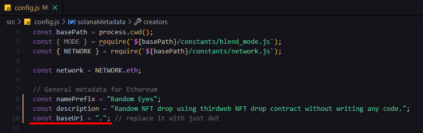

then do `yarn update_info` in the command line and the script will run and update your metadata. Your output file would be like this (red outline). Make sure the number of NFTs should match the number of your assets (green arrows).

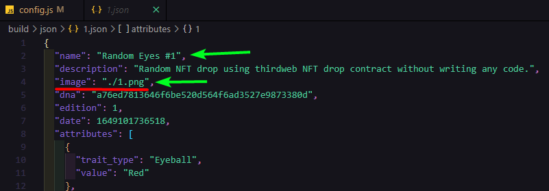

It doesn’t matter if you have a single metadata JSON file or multiple JSON files, our **batch upload** feature supports both of these. Just make sure to update the image base URI for the IPFS.

Let’s proceed to the randomizing of a **single metadata JSON file**.

Open your single metadata JSON file with your favorite code editor and copy all the contents of it and then go to this website — [Shuffle JSON](https://json-shuffle.online/). Paste the metadata code and click the **Shuffle** button. 

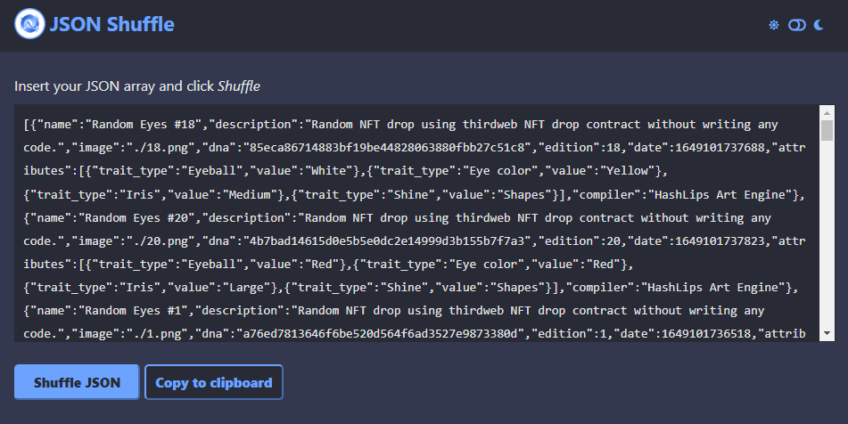

Copy the shuffled metadata and paste it into a new metadata JSON file. That would be the one you will upload to the dashboard.

Lastly, if you have the **multiple type of metadata JSON file** (*for example below*) you can use any third party software that can rename your files randomly.

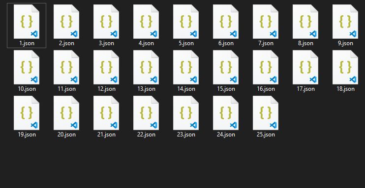

The idea here is to shuffle the file name (*the 1.json could be 25.json, and so on...*), select all the files and you can now upload them to the dashboard. You’re good to go!

## Upload the Metadata

Let’s upload the randomized metadata to the thirdweb dashboard using **batch upload**. Head back to the dashboard and select the NFT drop contract we created and click the **batch upload** button.

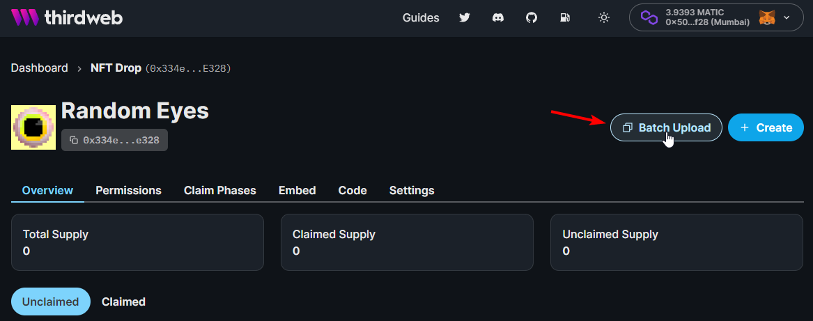

Drag and drop the **Metadata** file along with image assets.

:::info Take Note!

You must upload your metadata file in the same level with your image assets or else it will not work. See example set up below. 👇

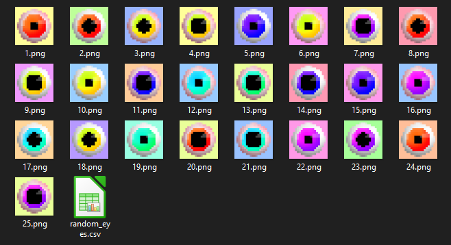

:::

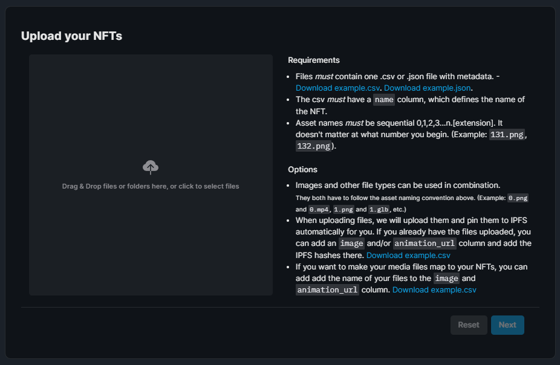

**Double-check the preview** if it is correct and randomized, and **click next**!

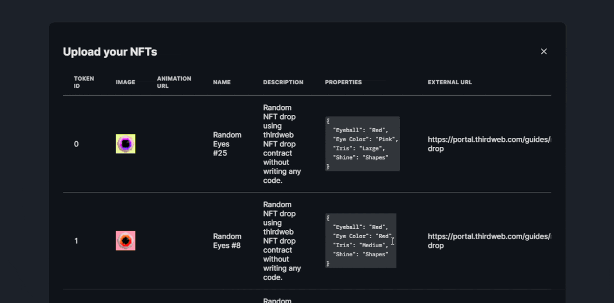

This time we will reveal the randomized NFTs upon mint instead of [delayed reveal](https://portal.thirdweb.com/guides/nft-drop-with-delayed-reveal) (*It is more fun if you combine delayed reveal with randomized order of NFT*). Lastly, click the upload NFT and we’re good to go! 🤘

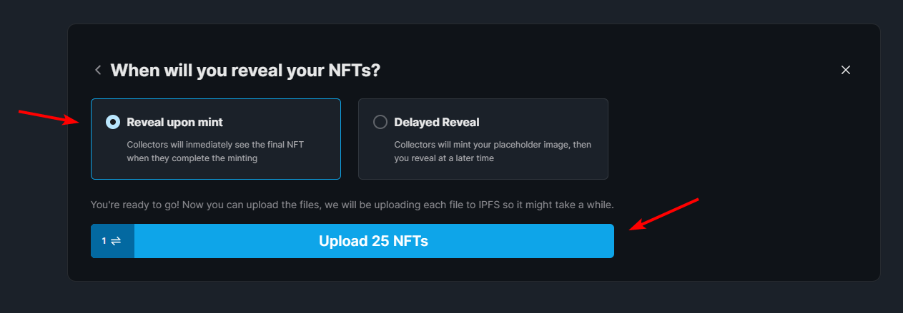

It shouldn’t take so long as we pre-uploaded the image assets. Wait for the wallet confirmation and the randomized NFT collection will appear on your contract dashboard.

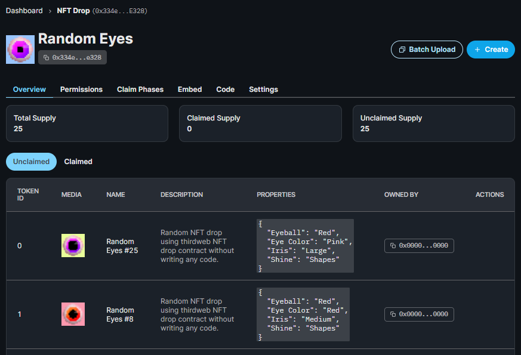

Here’s the final look, congrats! 👏

You can check the actual [deployed smart contract here](https://thirdweb.com/dashboard/mumbai/nft-drop/0x334eCa95454A95aaE49E740025A1af3cEdE0e328).

## That’s It!

You are finished! You have done a lot, let's recap:

- You randomized your NFT metadata order with no-code tools and techniques.
- You created your own NFT drop contract with claim conditions for your community to claim.

I hope you have enjoyed this guide, see you on the next one! 👋
