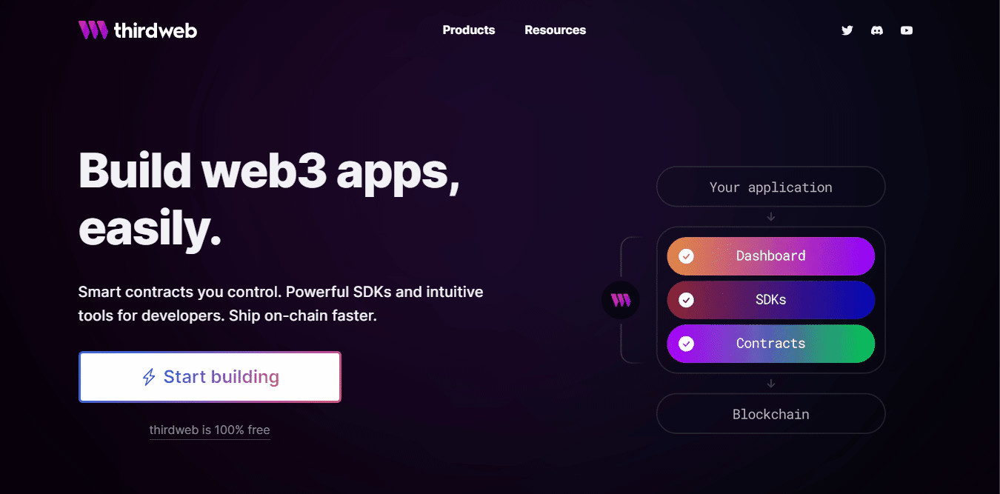
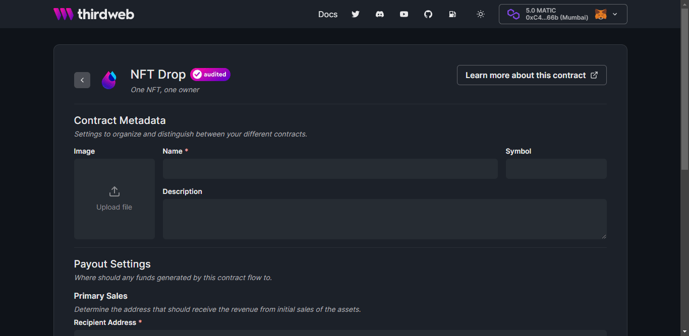
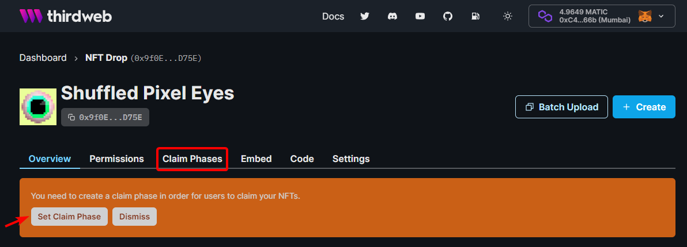
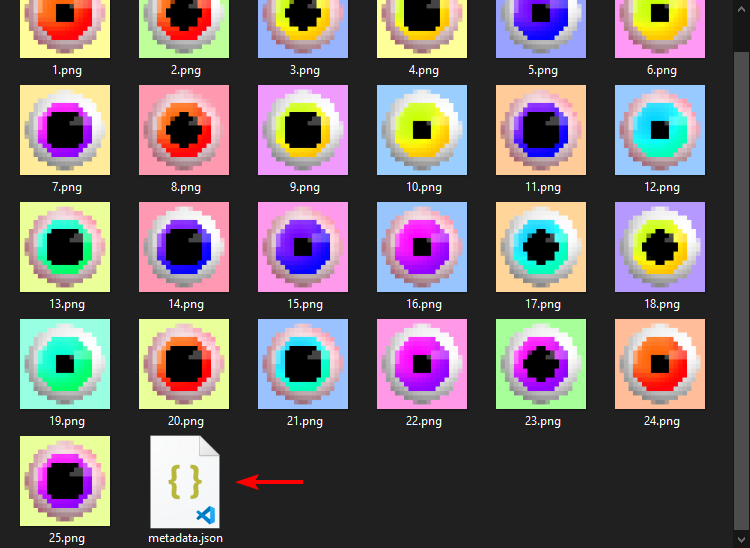
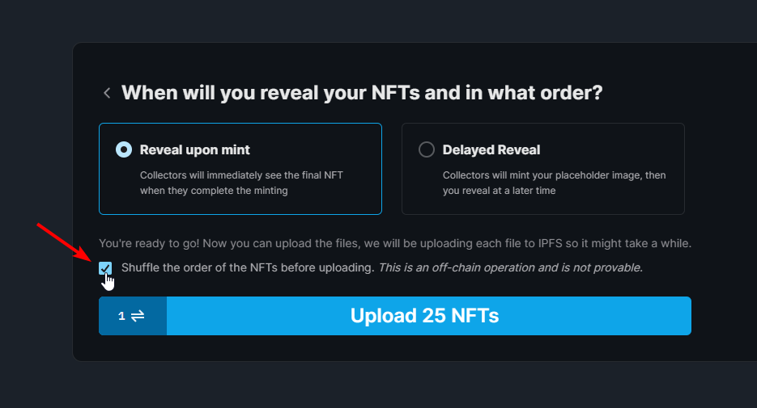
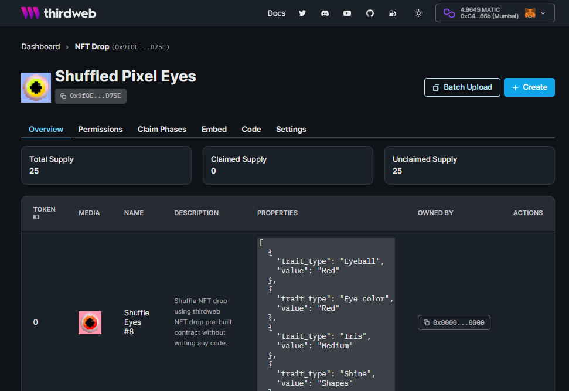

# Shuffle your NFT drop without writing any code

Learn how to shuffle your NFT drop without writing any code using the dashboard only.

<!-- truncate -->

## Intro

Let’s say you are ready to launch your first NFT project, but you want it to be shuffled for your community to mint. This is possible without writing any code by just using the thirdweb dashboard.

In this guide, we’ll [deploy a collection using the NFT drop contract](/guides/release-an-nft-drop-with-no-code), after that, we'll **batch upload** it to the dashboard and shuffle the metadata arrangement using the dashboard only. I’ll assume you have the metadata and the image assets ready, if not it is fine, I would recommend watching Hashlips’ [Generate NFT art and metadata speed run](https://youtu.be/8PcncMYQRU0) video.

## Setup

Let’s assume you’ve already a MetaMask wallet, if not please follow our [create a MetaMask wallet tutorial](/guides/create-a-metamask-wallet).

We’re going to use Polygon Mumbai Testnet for this guide, therefore, grab some test MATIC for the Mumbai Testnet using our tutorial on [how to get Matic on the Polygon Mumbai Testnet](/guides/get-matic-on-polygon-mumbai-testnet-faucet).

Lastly, you can use the same images I use for this guide: [download the image assets here](./shuffled-pixel-eyes.zip).

Now, let’s head over to the [thirdweb dashboard](https://thirdweb.com/dashboard) and deploy the [NFT Drop pre-built contract](/pre-built-contracts/nft-drop).

Next, fill out the metadata for your NFT Drop pre-built contract.

:::caution Keep in Mind!

You can't update or modify the token symbol once you deployed the contract.

:::

Once you're happy, click **Deploy Now** and **confirm the transaction**.

Once the transaction has been confirmed you will see the dashboard of your NFT drop contract and see something like this below.

You will need to set up your contract’s claim phases before we proceed to the next step. In this guide, I will not cover this, feel free to learn more about how to [create nft drop with claim phases here](/guides/create-nft-drop-with-claim-phases).

## Shuffle and Upload

Let’s upload your metadata and image assets to the thirdweb dashboard using the batch upload. Head back to the dashboard and select the NFT Drop pre-built contract we created and click the batch upload button.

Drag and drop the **Metadata** file along with **Image** assets.

:::info Take Note!

You must upload your metadata file in the same level with your image assets otherwise it will not work.

See example set up below. 👇

:::

Don't forget to **review your metadata and images** before clicking the next button.

:::caution Remember!

Pre-built contracts are immutable by design, meaning you can't modify or update the metadata and the image assets once you upload it. If looks good, feel free to continue!

:::

Let's choose **Reveal upon mint** for this guide, if you prefer [delayed reveal](/guides/nft-drop-with-delayed-reveal) go ahead.

After that, click the checkbox for "**Shuffle the order of the NFTs before uploading.**" and click **upload**!

:::caution Remember!

- Shuffle feature is an off-chain operation and is not provable.
- It will shuffle the order of **metadata** only **not the token ID**.
- Minting will still be sequential by token ID.

:::

Here’s the final look, congrats! 👏

You can check the actual [deployed smart contract here](https://thirdweb.com/dashboard/mumbai/nft-drop/0x9f0Edc4DD15CDC4e2487561ce4e74b42AD96D75E). 🎉

## That’s It!

You are finished! You have done a lot, let's recap:

- You shuffle your NFT metadata order using thirdweb dashboard only.
- You created your own NFT drop contract with claim conditions for your community to claim.

I hope you have enjoyed this guide, see you on the next one! 👋
