# Release an NFT Drop with signature-based minting using the Signature Drop contract

In this guide, we'll use the [Signature Drop](https://portal.thirdweb.com/pre-built-contracts/signature-drop)
contract to create a collection of NFTs that follow the [ERC-721A](https://www.erc721a.org/) standard!

<!-- truncate -->

Compared to the regular [ERC-721](https://eips.ethereum.org/EIPS/eip-721) standard, the ERC-721A implementation
optimizes the gas fees of the contract to enable cheaper gas fees for users when they are minting multiple tokens in one transaction.

The signature drop contract also enables [Signature-based Minting](https://portal.thirdweb.com/advanced-features/on-demand-minting)
which allows us, (the admin wallet), to approve users' mint requests on-demand if they meet specific criteria, such as being a holder of another token!

## Demo

Here's what we'll be doing in this guide:

- Deploying the ERC-721A Signature Drop contract.
- Lazy Minting our NFTs by batch uploading metadata files.
- Creating a web application where users can claim NFTs.
- Adding a special "Discount Claim" button where users who hold an NFT from another collection can claim an NFT for a discount!

Check out the demo here: https://signature-drop.thirdweb-example.com/

## Creating the Signature Drop Contract

To deploy one of thirdweb's [Pre-built contracts](https://portal.thirdweb.com/pre-built-contracts), head to the [dashboard](https://thirdweb.com/dashboard) and connect your wallet.

:::tip Create A Wallet

If you don't already have a wallet, learn how to get set up with MetaMask in our "[Guide: Create a MetaMask Wallet](https://portal.thirdweb.com/guides/create-a-metamask-wallet)"

:::


From here, click the `Deploy New Contract` button -> `Pre-Built Contracts` -> `Release a drop` -> `Signature Drop`.

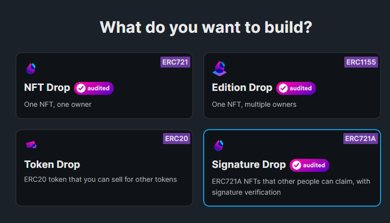

:::tip Audited Contracts

The Signature Drop is one of our audited contracts!

[Read the security audit to learn more](https://gateway.thirdweb.dev/ipfs/QmWfueeKQrggrVQNjWkF4sYJECp56vNnuAXCPVecFFKz2j).

:::

Here is where you can upload the metadata for the contract itself. This is the metadata that will show up on pages such as the OpenSea Collection page.

Give your contract a `name`, `symbol`, `description`, `image`, and configure royalty fees as you like! Here's how mine looks:

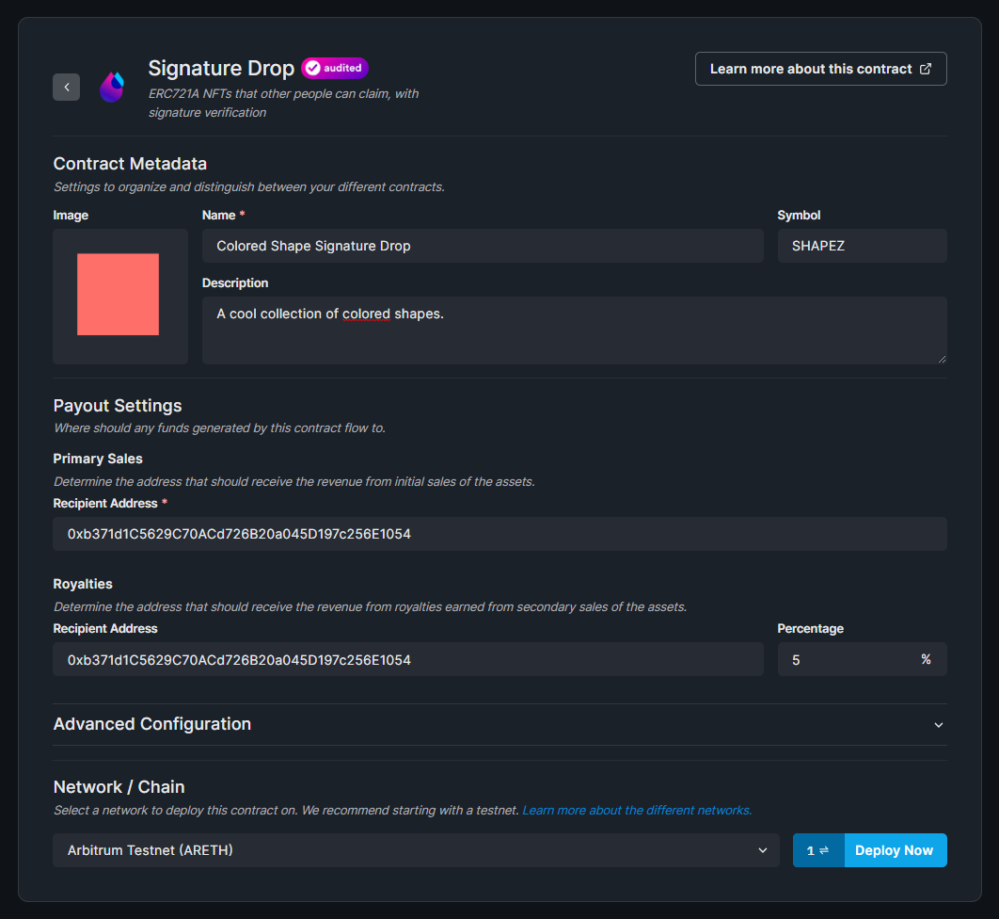

I'll be deploying to the [Arbitrum Testnet](https://portal.thirdweb.com/guides/which-network-should-you-use#arbitrum) as it
offers super-fast transaction approval times (which are great for testing purposes)!

When you're ready, click `Deploy Now`, and approve the `Deploy Proxy` transaction in your wallet.

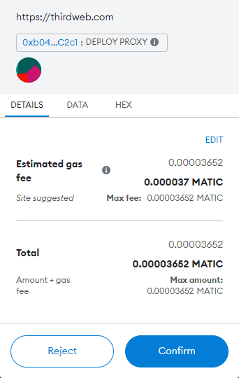

You just deployed your very own ERC-721A NFT Collection!


## Batch Lazy-Minting NFTs

In the Signature Drop contract, we **lazy-mint** all of our NFTs by uploading the metadata using the Batch Upload feature.

Click the `Batch Upload` button to get started.

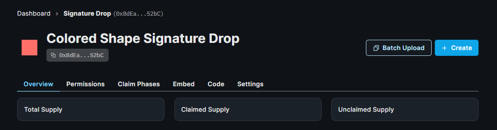

Here, you'll be taken to a page where you can drag and drop your metadata and assets to upload them. You can use the example CSV and JSON files from the links on this page, or below:

- [CSV Example File](https://www.thirdweb.com/example.csv)
- [JSON Example FIle](https://www.thirdweb.com/example.json)

Here is a preview of mine:

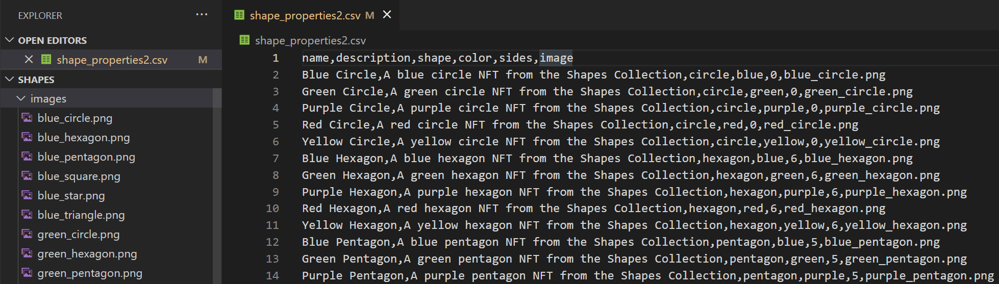

Once you've prepared the files, drag them all into the upload box on the dashboard:

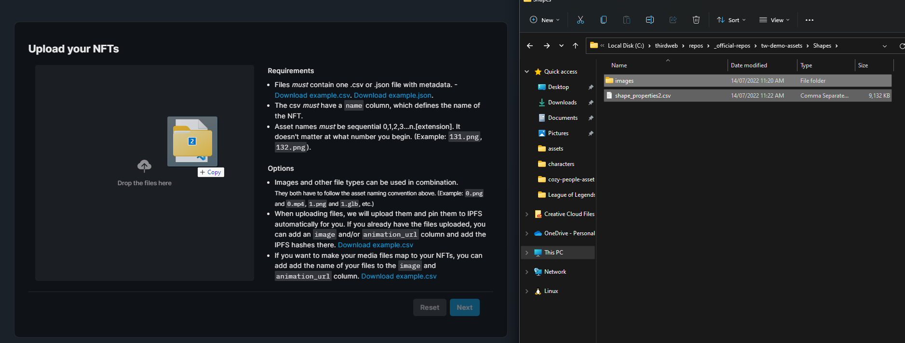

This will allow you to preview your NFTs before lazy minting them.
Ensure the properties and metadata appear how you expect, as you won't be able to modify them after they have been uploaded.

Once you're happy, click `Next`:

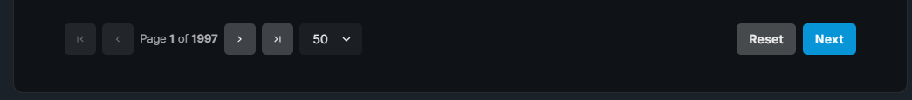

You can then choose if you want to add a [delayed reveal](https://portal.thirdweb.com/advanced-features/delayed-reveal) for your NFTs. For this guide, we'll leave it as `Reveal upon mint` and click **Upload NFTs**!

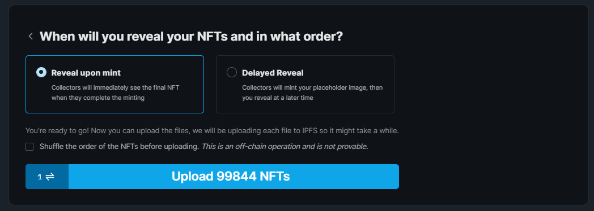

## Configuring A Claim Phase

Claim phases are conditions that outline **how**, **when**, and **who** can claim NFTs from your collection; such as an allowlist, release date, or [delayed reveal](https://portal.thirdweb.com/advanced-features/delayed-reveal).

To add a claim phase, click the `Claim Phases` tab and then the `Add Claim Phase` button:

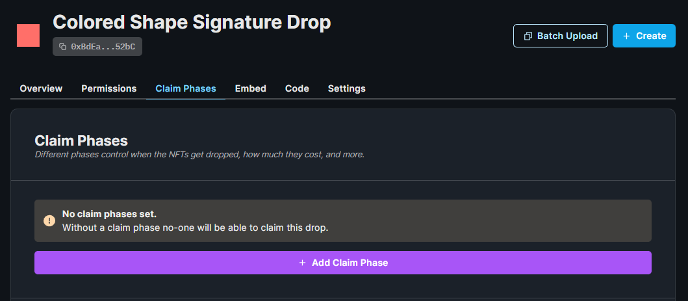

Here's where we can configure who can claim from this drop. I'm going to set the :

- `How much do you want to charge to claim the NFTs?` to be `0.01`
- `How many NFTs can be claimed per transaction?` to be `1`
- `How many seconds do wallets have to wait in-between claiming?` to be `Unlimited`

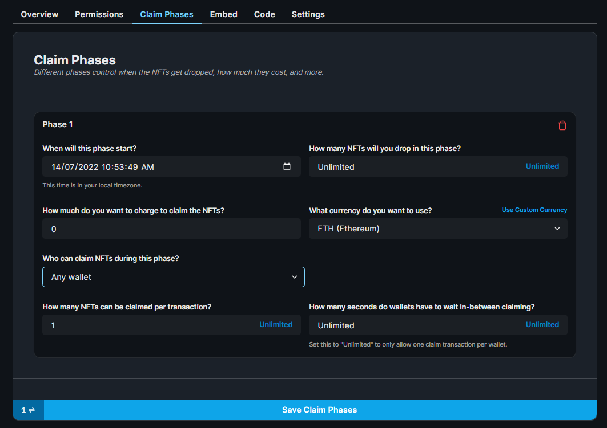

Once you're happy, click `Save Claim Phases`!

## Setting Up the project

We'll be using the [thirdweb CLI](https://portal.thirdweb.com/cli) to initialize our application using Next.js and TypeScript.

To create a new project using the CLI, run the following command:

```bash
npx thirdweb create
```

Give your application a name and the project will be initialized for us! Let's open the project up in a text editor now, I'll be using VS Code.

I'll be using the styles available in the [source code](https://github.com/thirdweb-example/signature-drop/tree/main/styles),
feel free to copy these files into your project if you want to use the same styles.

If we take a look at our `pages/app.tsx` file, we have a configured `activeChainId` as `Mainnet` which is Ethereum Mainnet.

Since we deployed our contract on the Arbitrum Test network let's change it to:

```jsx
// This is the chainId your dApp will work on.
const activeChainId = ChainId.ArbitrumTestnet;
```

## Connecting to our contract

Now we're ready to interact with our signature drop smart contract from within our code, to do that, we'll use the [useSignatureDrop](https://portal.thirdweb.com/react/react.usesignaturedrop) hook from the React SDK.

On the `index.tsx` page:

```jsx
const signatureDrop = useSignatureDrop(
  "0xBdEa6C9B18843cEA8262ead23767737512e452bC",
);
```

You can get your contract address from the dashboard:

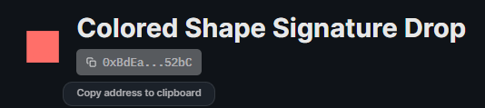

## Claiming NFTs

Since the wallet connection logic is already configured inside our application thanks to the thirdweb CLI, here's how our page looks now:

```jsx
const Home: NextPage = () => {
  const address = useAddress();
  const connectWithMetamask = useMetamask();
  const disconnectWallet = useDisconnect();

  const signatureDrop = useSignatureDrop(
    "0xBdEa6C9B18843cEA8262ead23767737512e452bC",
  );

  return (
    <div>
      {address ? (
        <>
          <button onClick={disconnectWallet}>Disconnect Wallet</button>
          <p>Your address: {address}</p>
        </>
      ) : (
        <button onClick={connectWithMetamask}>Connect with Metamask</button>
      )}
    </div>
  );
};

export default Home;
```

The React SDK automatically uses the signer of the connected wallet when a user wants to perform an action on our smart contract such as `claim` an NFT.

Let's write the logic for that now. Firstly, the `claim` function:

```jsx
async function claim() {
  const tx = await signatureDrop?.claim(1);
  console.log(tx);
}
```

And attach this function to a button:

```jsx
<button onClick={claim}>Claim</button>
```

If we preview our application by running `yarn dev` from the terminal and visit [http://localhost:3000/](http://localhost:3000/) we can see our claim button:

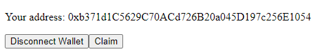

If you click the `Claim` button and approve the transaction, you can successfully mint the first NFT from the drop.

Now in the dashboard, we have a **Claimed Supply** of `1`

That is the very basics of our minting page setup!

## Claiming With Signature

The signature drop contract also allows users to claim using a signature generated by an admin wallet. This is a three-step process:

1. User requests a mint signature.
2. Admin wallet (on the server) approves (or denies) the claim request of the user based on any criteria the admin chooses and sends back a mint signature when they approve.
3. User uses the mint signature to claim NFTs from the signature drop.

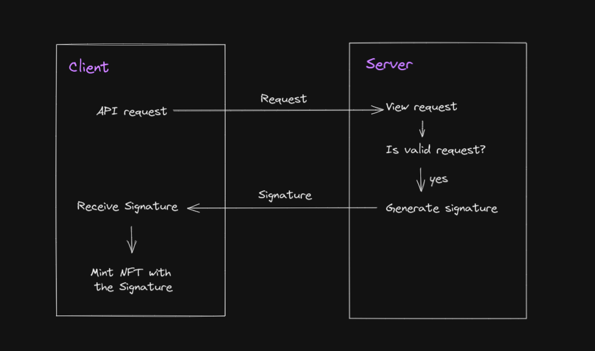

This enables all kinds of possibilities for us, such as:

- Restrictions of who can claim based on off-chain data
- Discounts for users who meet some criteria (such as owning another NFT, or being part of a Discord server)

We're going to check if the wallet owns one of our thirdweb [Early Access Card NFTs](https://opensea.io/collection/thirdweb-community) and offer them a free mint if they do!

### Creating the API Route

Let's go back to our code, and under the `pages` folder, create an `api` folder. Within it, create a file called `generate-mint-signature.ts`.

Let's firstly create the basic structure of our API route:

```js
import { ThirdwebSDK } from "@thirdweb-dev/sdk";
import type { NextApiRequest, NextApiResponse } from "next";

export default async function generateMintSignature(
  req: NextApiRequest,
  res: NextApiResponse,
) {
  // De-construct body from request
  const { address } = JSON.parse(req.body);

  // Next code snippet here
}
```

When we call this API endpoint, we'll be passing an `address` argument into the request body. In this API route, we de-structure that value so that we can use it when we generate the mint signature.

Since we're going to provide the NFTs for free to wallets that own one of thirdweb's [Early Access NFTs](https://opensea.io/collection/thirdweb-community), let's check that now.

To do that, we instantiate the thirdweb SDK with a read-only connection on the Polygon network and get the `thirdweb-community` NFT Collection using its contract address.

```js
// Get the Early Access NFT Edition Drop contract
const polygonSDK = new ThirdwebSDK("polygon");
const earlyAccessNfts = polygonSDK.getEditionDrop(
  "0xa9e893cc12026a2f6bd826fdb295eac9c18a7e88", // this is the thirdweb-community NFT Collection address.
);
```

Then we can use the `balanceOf` function to check if the wallet that made this API request has any NFTs from that collection. Since it's an ERC-1155 collection, we check to see if they have a `balanceOf` **any** of the tokens in that collection in a loop:

```js
// Check to see if the wallet address has an early access NFT
const numTokensInCollection = await earlyAccessNfts.getTotalCount();
let userHasToken = false;
// Check each token in the Edition Drop
for (let i = 0; i < numTokensInCollection.toNumber(); i++) {
  // See if they have the token
  const balance = await earlyAccessNfts.balanceOf(address, i);
  if (balance.toNumber() > 0) {
    userHasToken = true;
    break;
  }
}
```

Great! Now we have a `userHasToken` variable that is true _if_ the user had a balance greater than zero for any token in that ERC-1155 NFT Collection.

Now we can use that variable to determine whether or not we generate a mint signature for this user:

```js
  // Now use the SDK on Goerli to get the signature drop
  const arbitrumSDK = ThirdwebSDK.fromPrivateKey(
    process.env.PRIVATE_KEY as string,
    "arbitrum-testnet"
  );
  const signatureDrop = arbitrumSDK.getSignatureDrop(
    "your-contract-address-here" // Your contract address here
  );

  // If the user has an early access NFT, generate a mint signature
  if (userHasToken) {
    const mintSignature = await signatureDrop.signature.generate({
      to: address, // Can only be minted by the address we checked earlier
      price: "0", // Free!
      mintStartTime: new Date(0), // now
    });

    res.status(200).json(mintSignature);
  } else {
    res.status(400).json({
      message: "User does not have an early access NFT",
    });
  }
```

In the above snippet, we are using our private key to instantiate the SDK on behalf of our admin wallet.

:::info How to export your private key

Learn how to [export your private key](/guides/create-a-metamask-wallet#export-your-private-key) from your wallet.

:::

To do this, create a file called `.env` at the root of your project, and add the following to it:

```
PRIVATE_KEY=your-private-key-here
```

:::warning

Ensure you store and access your private key securely.

- **Never** commit any file that may contain your private key to your source control.

:::

### Using the API Route on the Front-end

On our home page, we need a way to call our API route, let's write that function now.

Here, we check to see if the mint signature came back from the API request. If it didn't, we display an error message. If it did, we call the
`signature.mint` with the mint signature to claim the NFT.

```jsx
  async function claimWithSignature() {
    const signedPayloadReq = await fetch(`/api/generate-mint-signature`, {
      method: "POST",
      body: JSON.stringify({
        address: address,
      }),
    });

    if (signedPayloadReq.status === 400) {
      alert(
        "Looks like you don't own an early access NFT :( You don't qualify for the free mint."
      );
      return;
    }

    try {
      const signedPayload =
        (await signedPayloadReq.json()) as SignedPayload721WithQuantitySignature;

      console.log(signedPayload);

      const nft = await signatureDrop?.signature.mint(signedPayload);

      alert(`Succesfully minted NFT!`);
    } catch (error: any) {
      alert(error?.message);
    }
  }
```

Now all we need to do is add a new button that calls this function:

```js
<button onClick={() => claimWithSignature()}>Claim Free with signature</button>
```

Let's test it out:

On a wallet that **doesn't** own one of these Early Access NFTs, the mint signature is not granted to them, meaning they are unable to mint for free using the signature minting method:

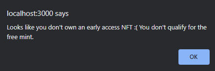

On a wallet that **does** own the Early Access NFTs, they are allowed to mint an NFT for free rather than paying with the regular claim method!

Once the transaction is confirmed, we should see:

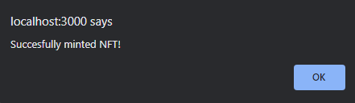

## Conclusion

That's it! You have successfully created your very own ERC-721A NFT collection with signature minting, and built an app to claim your NFTs on top of it!

To learn more about what you can do with the signature drop contract, check out the [Portal documentation](https://portal.thirdweb.com/pre-built-contracts/signature-drop)!
