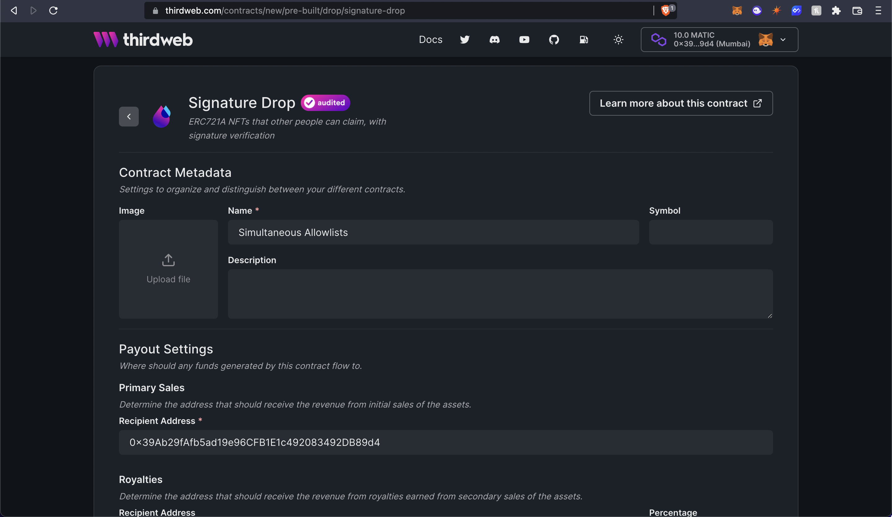
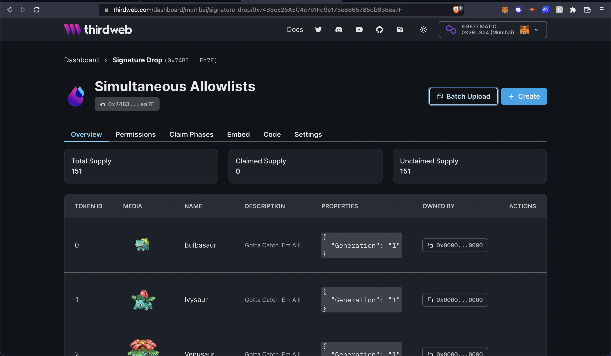

# Create Simultaneous Allowlists drop with Signature Drop and Next.js

Learn how to create simultaneous allowlists where different users can buy NFTs from the drop at a different price based on which allowlist they are in.

<!-- truncate -->

## Introduction

In this guide, we are going to create a [Signature drop](/pre-built-contracts/signature-drop) where users
will be able to connect their wallets to the website and claim an NFT from the drop. Once the user clicks `Mint`, we will make an
API request that checks if the user is in one of our allowlists.

Based on the check, we will generate a signature with a different price for each allowlist! Let's get started.

## Setup

I am going to use the [Next typescript starter template](https://github.com/thirdweb-example/next-typescript-starter) for this guide.

If you are following along with the guide, you can create a project with the
[Next TypeScript template](https://github.com/thirdweb-example/next-typescript-starter) using the [thirdweb CLI](/cli):

```bash
npx thirdweb create --next --ts
```

If you already have a Next.js app you can simply follow these steps to get started:

- Install `@thirdweb-dev/react` and `@thirdweb-dev/sdk` and `ethers`
- Add MetaMask authentication to the site. You can follow this [guide](/guides/add-connectwallet-to-your-website) to do this.

By default the network in `_app.tsx` is Mainnet, we need to change it to Mumbai

```tsx title="_app.tsx"
import type { AppProps } from "next/app";
import { ChainId, ThirdwebProvider } from "@thirdweb-dev/react";

// This is the chainId your dApp will work on.
const activeChainId = ChainId.Mumbai;

function MyApp({ Component, pageProps }: AppProps) {
  return (
    <ThirdwebProvider desiredChainId={activeChainId}>
      <Component {...pageProps} />
    </ThirdwebProvider>
  );
}

export default MyApp;
```

## Creating a Signature Drop and batch Uploading NFTs

We also need to create a Signature Drop and upload a bunch of NFTs that users can claim.
So, go to the [thirdweb dashboard](https://thirdweb.com/dashboard) and create a signature drop!

Fill out the details and deploy the contract!



Now, let's batch upload some NFTs for the users to mint!
I am going to use the [pokemon batch upload example](https://github.com/nachoiacovino/thirdweb-pokemon).

Click on batch upload and upload the images and the CSV/JSON file.

Once they are uploaded you will be able to see the NFTs! To learn more about batch upload check out [this guide](/guides/how-to-batch-upload).



## Making the website

### Creating an API for generating a signature

We are going to use the signature minting on our backend to check the price at which this user will mint the NFT!

Create a new folder `api` in the pages folder and `generate-mint-sig.ts` inside it.

We will now build a basic API that will output "gm wagmi"

```ts title="api/generate-mint-sig.ts"
import type { NextApiRequest, NextApiResponse } from "next";

const generateMintSignature = async (
  req: NextApiRequest,
  res: NextApiResponse,
) => {
  res.send("gm wagmi");
};

export default generateMintSignature;
```

This creates a basic API for us, if you now go to the [`api/generate-mint-sig`](http://localhost:3000/api/generate-mint-sig)
endpoint, you will get a response of `Gm wagmi`.


Let's now initialize the [thirdweb SDK](/web3-sdk)!

```ts
const sdk = ThirdwebSDK.fromPrivateKey(
  process.env.PRIVATE_KEY as string,
  "mumbai",
);
```

As you can see, we are using an environment variable to initialize the sdk.
The variable is called `PRIVATE_KEY` which is the private key of the wallet.
Create a new file `.env.local` and add your private key.

```bash title=".env.local"
PRIVATE_KEY=<private_key>
```

:::info How to export your private key

Learn how to [export your private key](/guides/create-a-metamask-wallet#export-your-private-key) from your wallet.

:::

To do this, create a file called `.env.local` at the root of your project, and add the following to it:

```
PRIVATE_KEY=your-private-key-here
```

:::warning

Ensure you store and access your private key securely.

- **Never** commit any file that may contain your private key to your source control.

:::

We also need to import the `ThirdwebSDK`:

```tsx
import { ThirdwebSDK } from "@thirdweb-dev/sdk";
```

**Determining the price of the NFT**

I am creating 2 hardcoded arrays in this example, but you can get them from a JSON file, from a database, or anything you like!

So add these 2 arrays and a function to determine the price:

```ts title="/api/generate-mint-sig.ts"
const teamMembers = ["0x39Ab29fAfb5ad19e96CFB1E1c492083492DB89d4"];

const allowList = ["0x6bF08768995E7430184a48e96940B83C15c1653f"];

const determinePrice = (address: string) => {
  if (teamMembers.includes(address)) {
    return 0;
  }
  if (allowList.includes(address)) {
    return 1;
  }
  return 2;
};
```

So if the person is in the allowlist they will mint the NFT for 1 MATIC, if they are a team member they will mint the NFT for 0 MATIC,
and if they are not in an allowlist, they will mint the NFT for 2 MATIC.

**Generating the signature**
Finally, we are going to access the Signature Drop using the sdk and generate a signature from it:

```ts title="api/generate-mint-sig.ts"
const { address } = req.body;

const drop = sdk.getSignatureDrop("0xcB31341eE7FaC6917e8e9D71441747e5FAdA466F");
try {
  const signedPayload = await drop.signature.generate({
    to: address,
    price: determinePrice(address),
  });

  return res.status(200).json({
    signedPayload: signedPayload,
  });
} catch (error) {
  console.log(error);
  return res.status(500).json({
    error,
  });
}
```

### Calling the API from the frontend

In `index.tsx` update the address ternary and add the Mint button:

```tsx title="index.tsx"
<div>
  {address ? (
    <button onClick={mint}>Mint</button>
  ) : (
    <button onClick={connectWithMetamask}>Connect with Metamask</button>
  )}
</div>
```

Now we will create the mint function that makes an api call to the backend and mints the NFT:

```tsx title="index.tsx"
const drop = useSignatureDrop("0xcB31341eE7FaC6917e8e9D71441747e5FAdA466F");

const mint = async () => {
  const signedPayloadReq = await fetch("/api/generate-mint-sig", {
    method: "POST",
    body: JSON.stringify({ address }),
  });

  const signedPayload = await signedPayloadReq.json();

  try {
    const nft = await drop?.signature.mint(signedPayload.signedPayload);
    return nft;
  } catch (err) {
    console.error(err);
    return null;
  }
};
```

If we now try minting the NFT, we will be able to mint the NFT successfully at different prices! 🎉

## Conclusion

This was a lot, now pat yourself on the back and share your amazing apps with us!
If you want to have a look at the code, check out the [GitHub Repository](https://github.com/thirdweb-dev/examples/tree/main/typescript/simultaneous-allowlists).
