## Intro

In this guide we will show you how to switch between networks on your desktop and mobile phone.

## What are networks

There are different types of blockchain. Just like cloud. You have google cloud and apple cloud. In the blockchain world its the same. The two most popular ones for NFTs are Ethereum and Polygon.

### Mainnets vs Testnets

Everything you store on the blockchain is permanent. So you need to be extra careful if you deploy stuff on the blockchain. This also means you cannot 'test' on blockchains such as Ethereum and Polygon. So to test our smart contracts and transactions we use 'Test networks'. These are blockchains that operate exactly like 'Main networks', such as Ethereum and Polygon. However the currency on these networks are free and they are not used for commercial transactions or production use-cases.

## Desktop

### Logging in for the first time

If you log in for the first time on your desktop, you will be able to select a network after connecting your wallet and creating a contract.

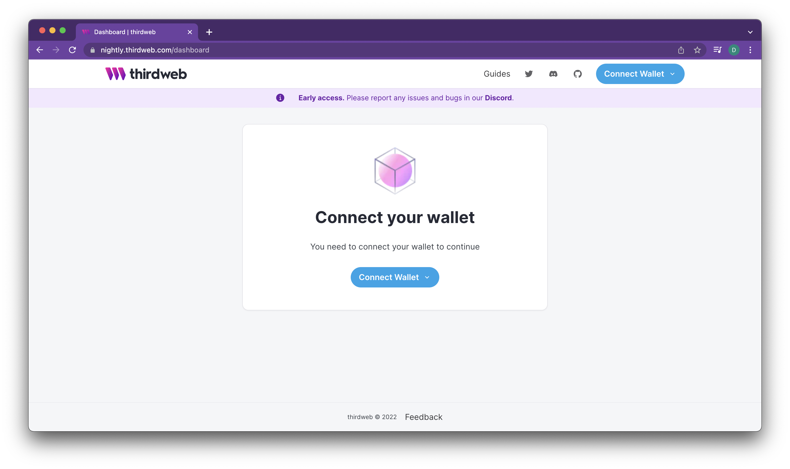

Another way to switch between networks is to click on your wallet inside your browser.

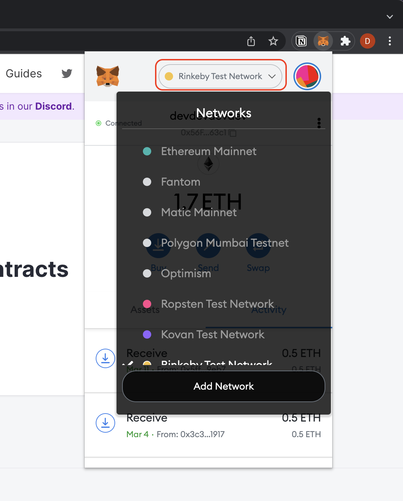

Finally you can select your network when deploying a contract inside the thirdweb dashboard.

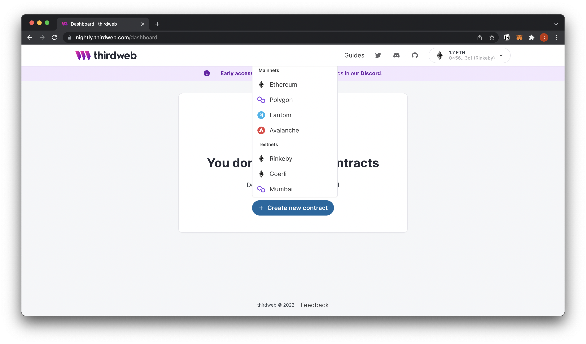

## Mobile

### Logging in the first time

If you log in the thirdweb for the first time, use WalletConnect to connect your wallet. Then you can pick a network after connecting your wallet and selecting "Create new contract".

<ImageSideToSide>

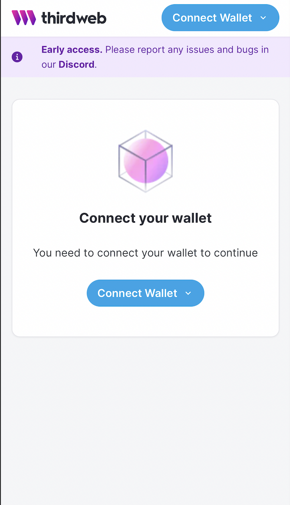

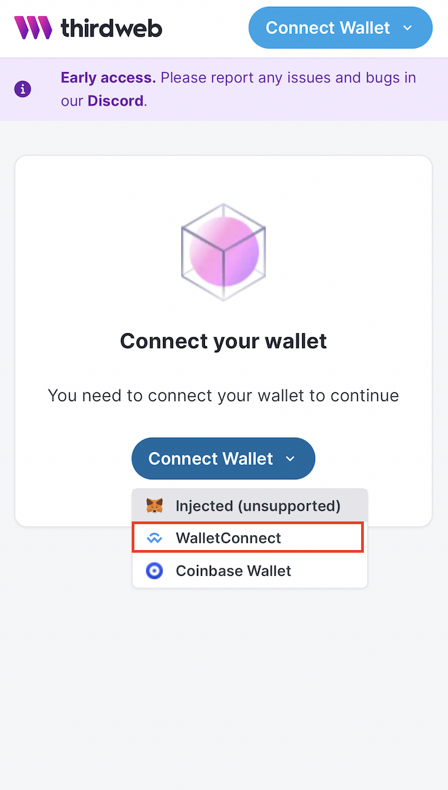

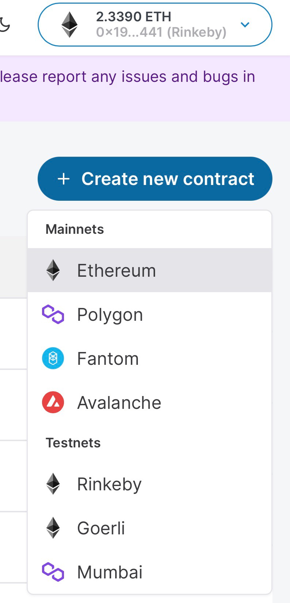

</ImageSideToSide>

## WalletConnect - Rainbow wallet

### Logging in for the first time

Open your Rainbow wallet and check if you're network is set to Ethereum.

<ImageSideToSide>

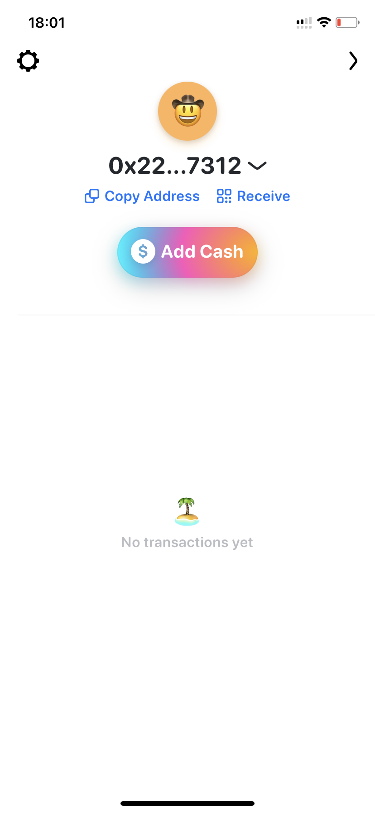

</ImageSideToSide>

Next up go to [thirdweb](http://thirdweb.com/dashboard) and follow the steps to connect your wallet.

<ImageSideToSide>

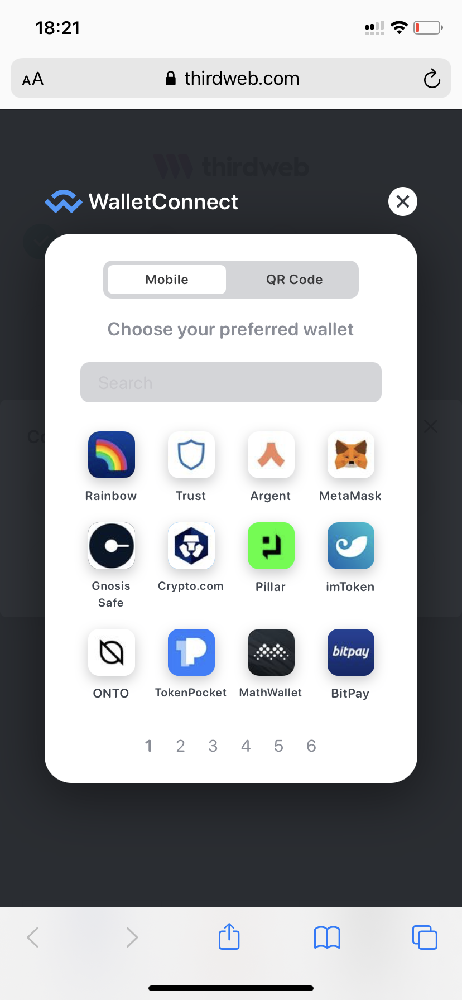

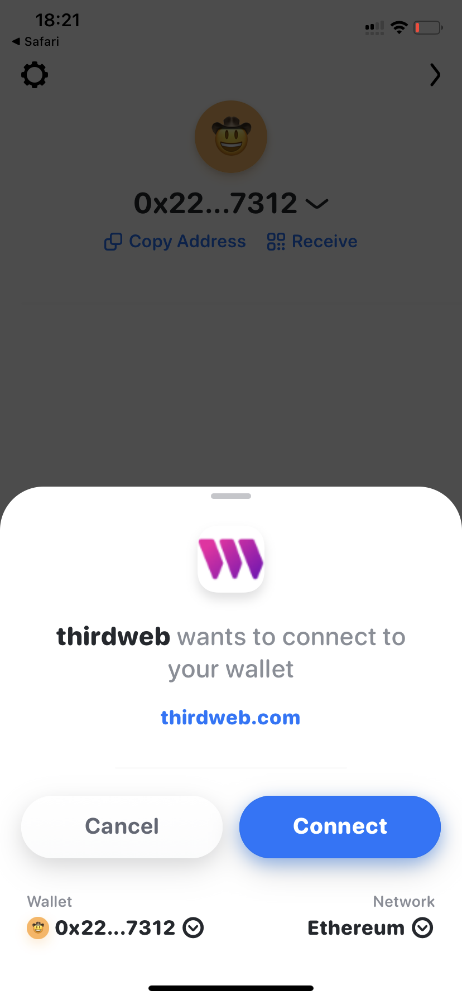

</ImageSideToSide>

After connecting your wallet via Walletconnect and choosing rainbow wallet, your network should automatically be the same as your network in the previous step. If it isn't, manually select the **same** network. If you want to switch networks, this will be shown in the next step.

### Switching networks from your wallet

If you want to deploy on a different network than you are currently on, please return to your wallet and update the network. When you return to the dashboard you will be connected to the updated network and are ready to create your contract.

Here we go to our wallet app on our phone and change the network to Rinkeby.

<ImageSideToSide>

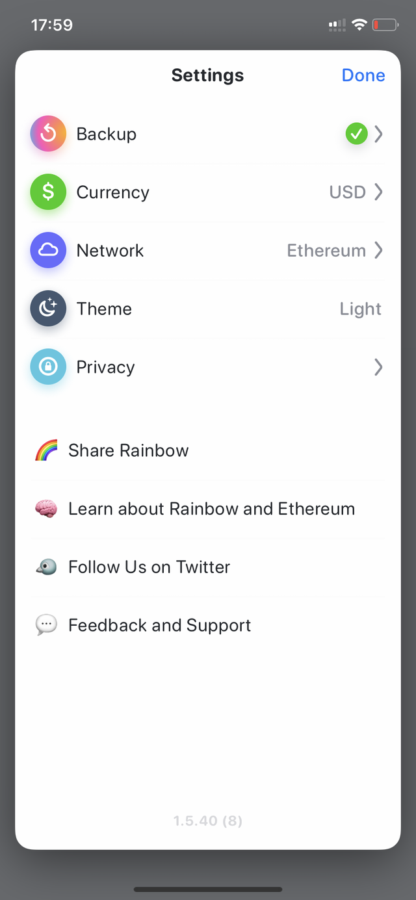

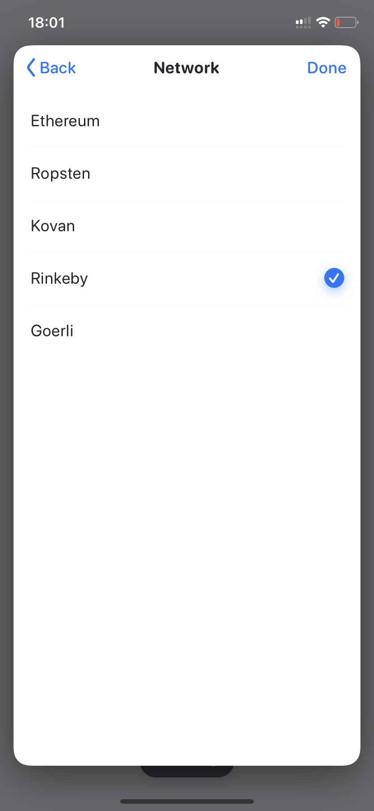

</ImageSideToSide>

Now we go back to the browser and our network should be changed.

<ImageSideToSide>

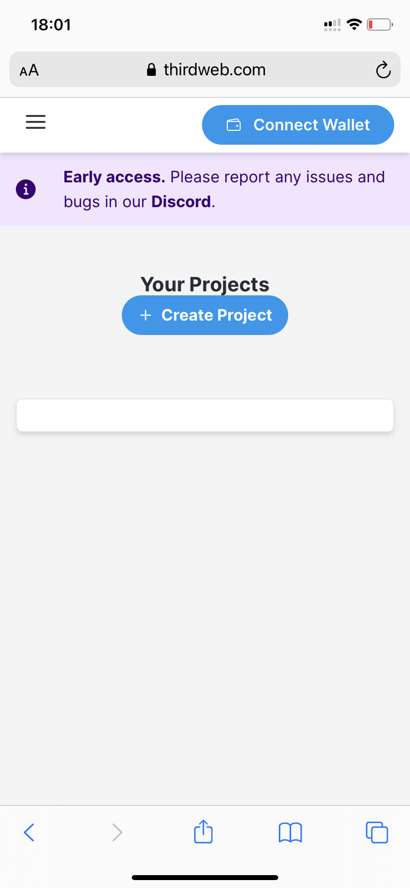

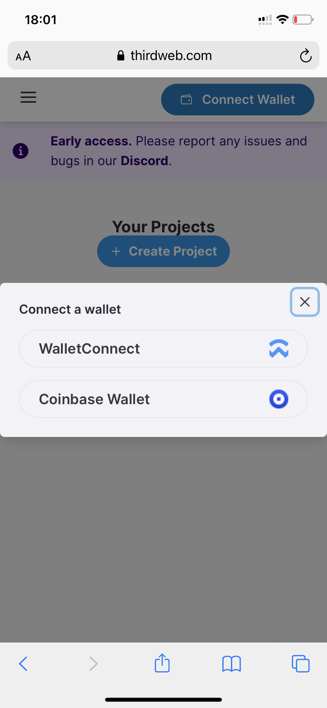

</ImageSideToSide>

The browser should redirect you to the rainbow app. Approve the connection.

<ImageSideToSide>

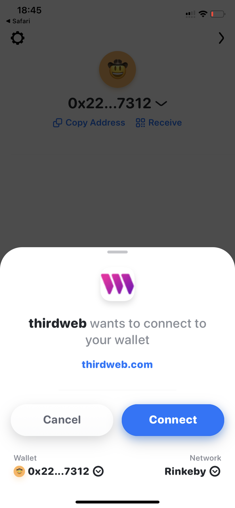

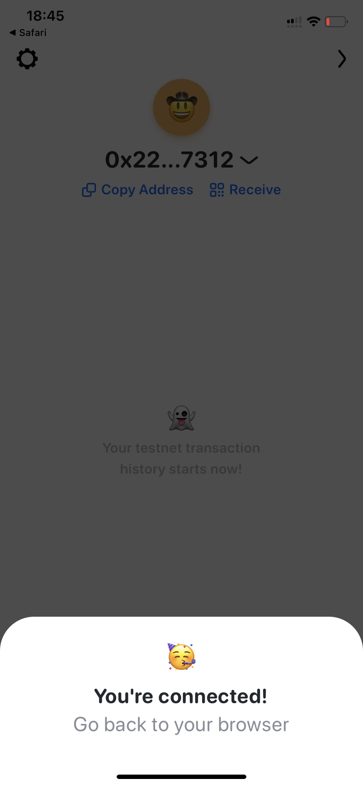

</ImageSideToSide>

Go back to your browser and your network should be changed.

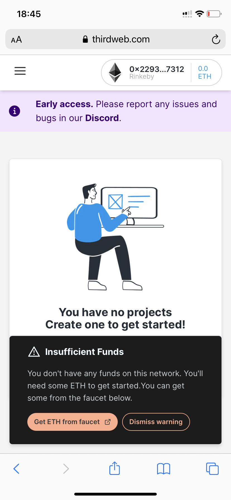
