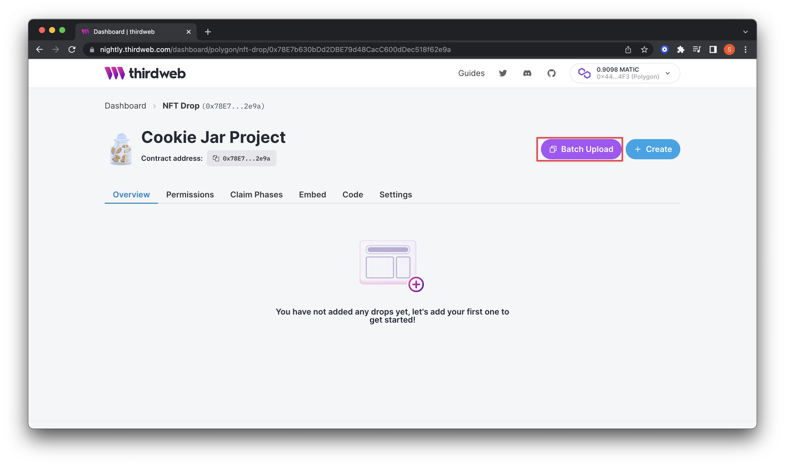
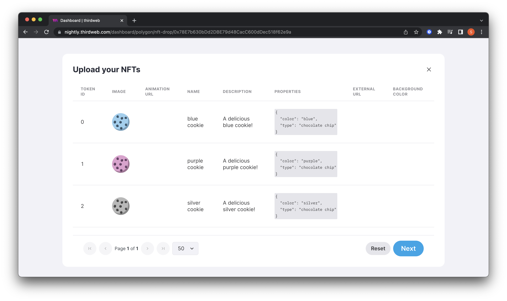
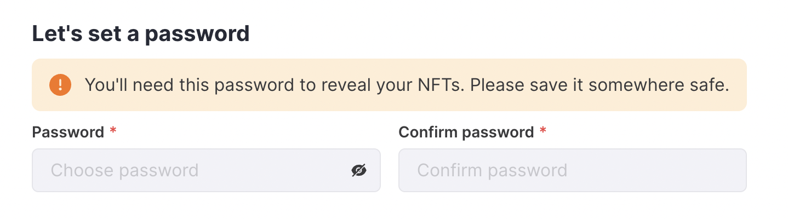
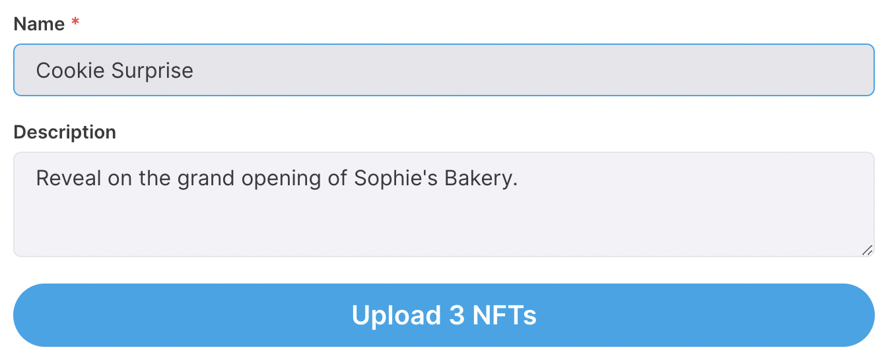
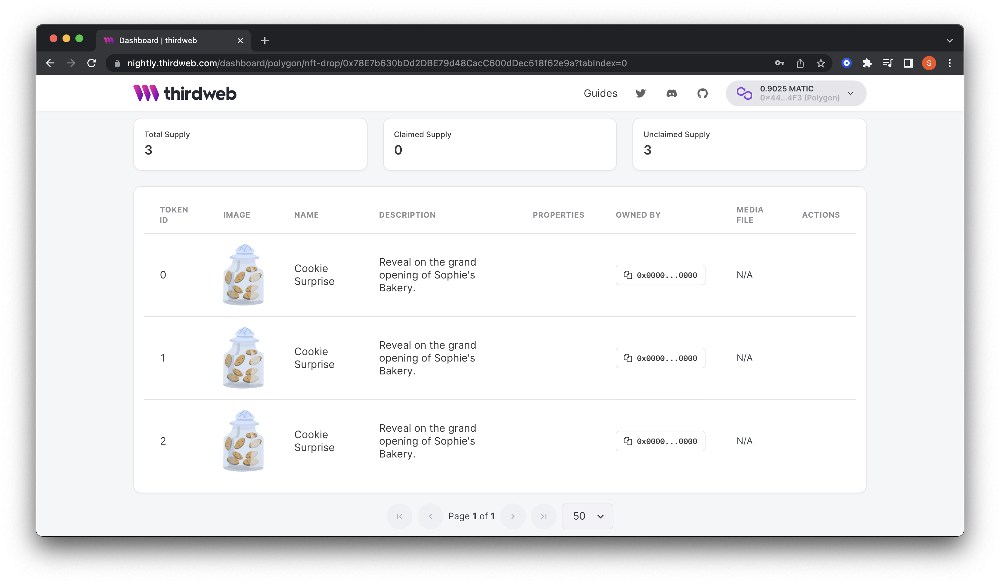
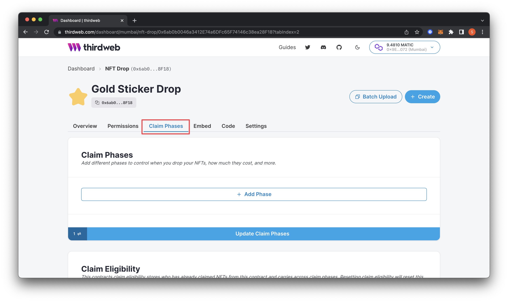
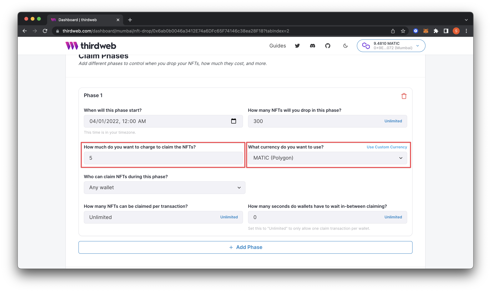
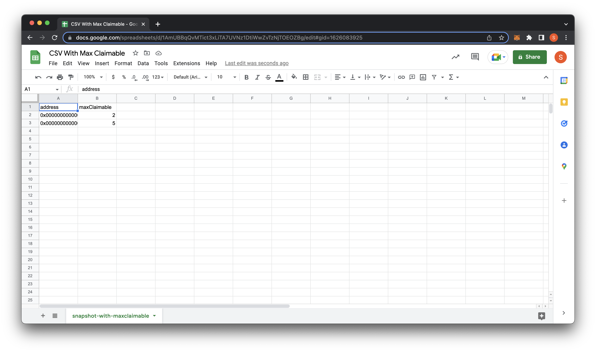
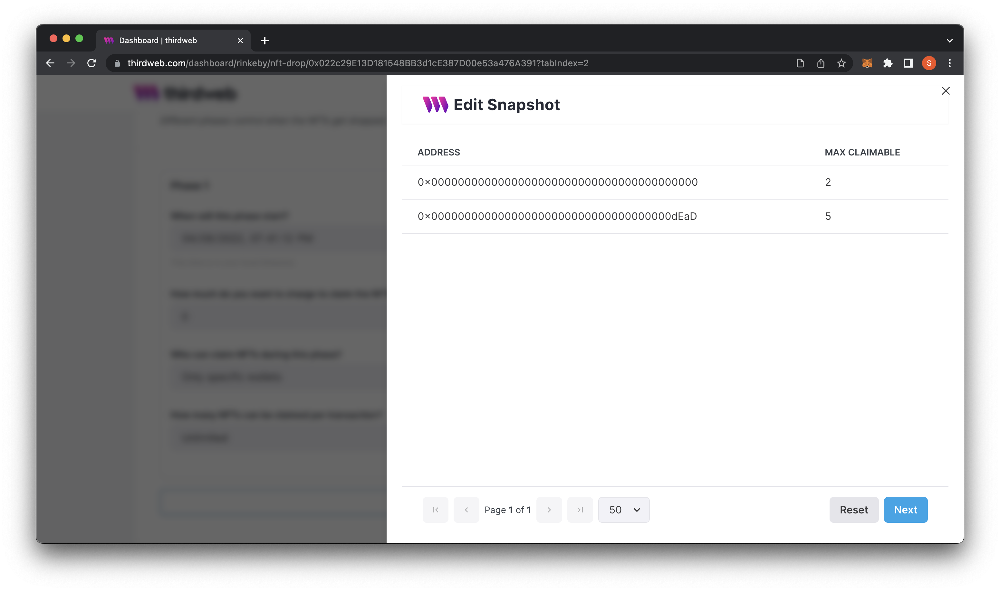
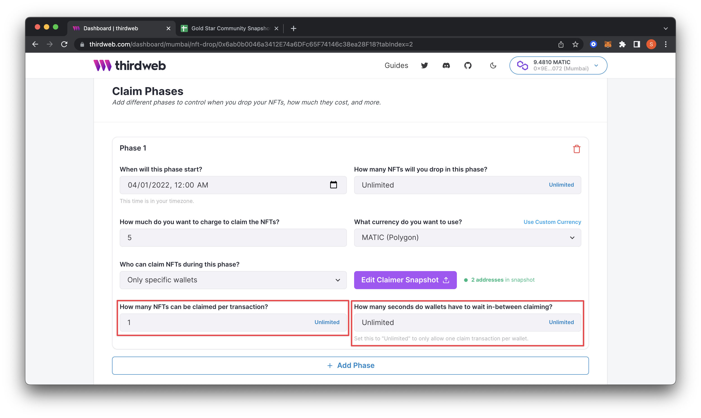

# Create the Ultimate NFT Drop with thirdweb x MintParty

Learn how to set up an NFT drop complete with allowlist & social integration, pre-audited smart contract, multiple claim phases, and delayed reveal.

<!-- truncate -->

## Bear Markets Are For Builders

NFTs, web3, and crypto have recently been a popular focus of pundits, bulls, and bears alike. The skepticism around the decentralized future of the internet continues to wax and wane. While we respect all of the discourse….we think it’s a bit more beneficial to focus on giving the builders what they need - tools they commonly use in premint, during mint, and post-mint. In times like this, there is no better outlet than hacking away at a keyboard on your passion project, and we're dedicated to simplifying the web3 development process for builders & creators.

This guide will explore how to set up an NFT drop complete with an allowlist and social connectors courtesy of our friends at **[MintParty](https://about.mintparty.xyz/blog-pages/how-to-guide-mintparty-x-thirdweb-for-launching-your-nft-drop?utm_source=thirdweb&utm_medium=guide&utm_campaign=thirdparty)** during the premint phase. In addition, we’ll leverage thirdweb’s pre-built & audited [**NFT drop**](/guides/create-nft-drop-with-claim-phases) smart-contract to power the blockchain component. Finally, we’ll set up our drop with an allowlist (also known as NFT whitelist), multiple claim phases, AND [delayed reveal](/guides/nft-drop-with-delayed-reveal). EPIC. Let’s dive in!

Of Note: Allowlist is commonly interchanged with ‘NFT whitelist’ — if that is how you understand the process of prioritizing a community of avid participants premint, we ask that you kindly consider the ramifications of using this (NFT whitelist) term in the future.

### How and why should you use MintParty and thirdweb?

Anyone who’s deployed an NFT collection or smart contract will attest that it can be time-consuming and complex. Manually uploading your artwork and metadata or keeping track of social giveaways via spreadsheet is a grueling ordeal. Enter thirdweb and MintParty. Create your VIP allowlists, activate your community with social giveaways, leverage seamless SDKs and UI/UX components, and more!

## Walkthrough

For the first part of this guide, we’ll head over to our friends at **[MintParty.xyz](https://about.mintparty.xyz/blog-pages/how-to-guide-mintparty-x-thirdweb-for-launching-your-nft-drop?utm_source=thirdweb&utm_medium=guide&utm_campaign=thirdparty)**. It’s essential to keep in mind a few details ahead of dropping your NFT collection:

- rewarding early adopters and supporters of your project
- verifying social or wallet credentials for giveaways or other tactics

Many projects accomplish this through a tactic called **allowlists** (or you may have also heard the term, allow lists, whitelisting or whitelist). Allowlists are a VIP or pre-approved list of wallet addresses that have early access to the NFT mint, often at reduced prices. Additionally, these groups of allowlists will often be the target of airdrops or other gamification mechanics to drive further growth.

Collecting allowlists can be done through a number of ways, some include collaborations and partnerships with other projects and running games and contests with your community within Discord and Twitter.
Head on over to MintParty’s **[Guide on How to Use Mintparty](https://about.mintparty.xyz/blog-pages/how-to-use-mintparty-to-help-with-your-nft-launch)** to help with your NFT launch for a full walk through and get started right away!

### How To Mint With thirdweb

Once we’ve set up our allowlist with MintParty, we’ll jump into setting up our smart contract, claim phases, allowlist, and more. In this guide, we'll create a drop using the NFT Drop contract and opt to reveal them later. To do so, we will set up some conditions to reveal the NFTs in the dashboard.

This guide assumes you already know how to make a contract through the thirdweb dashboard. If you need a refresher, feel free to check out:

- [Release an NFT drop on your own site without writing any code (Dashboard)](/guides/release-an-nft-drop-with-no-code)
- [Create an NFT Drop Contract (SDK)](/pre-built-contracts/nft-drop#create-an-nft-drop-contract)

### Batch Upload NFTs

After creating either an [NFT Drop](/pre-built-contracts/nft-drop) or [Edition Drop](/pre-built-contracts/edition-drop) smart contract, click on Batch Upload on the top right of the dashboard.

You will be prompted to upload your NFTs with a .csv or .json file that captures each NFT’s metadata. In this project, the NFTs we are uploading are images, or more specifically `.png` files.

Upon uploading, the dashboard will display all of your NFTs. Click Next if everything looks correct!

### Set the Delay Feature

On the next screen, we can finally choose how to reveal our NFTs. We have two options:

- **Reveal upon mint:** Collectors will immediately see the final NFT when they complete the minting.
- **Delayed Reveal:** Collectors will mint your placeholder image, then you reveal it at a later time.

For this guide, we are going to choose Delayed Reveal.

When you select Delayed Reveal, you will be prompted to create a password (please make sure to store this securely somewhere).

After setting your password:

- Upload your placeholder image.
- Add a temporary name for the unrevealed NFTs and a description.
- Click **Upload** when you are finished.

When you return to the dashboard, your NFTs will display with the placeholder data.

We’ll next add some claim phases and an allowlist to our drop to enable special claiming for our early adopters and VIPs before opening up claiming to the public and eventually revealing the artwork to our community. To do that, head over to the highlighted claim phases tab below.

### Add First Claim Phase

The first phase we will add is for early supporters or the community.

First, we will set **"When will this phase start?"** to April 1st, 2022, at 12:00 am (local time). This date and time are when I want my community to be able to start claiming the NFT.

I will change the second setting, **"How many NFTs will you drop in this phase?"** to "300". I only want to give 300 of the total supply of NFTs out to the community in this phase. Feel free to adjust it to what makes sense for your drop.

Now, we can set how much we want to charge using **"How much do you want to charge to claim the NFTs?"** to 5 and change **"What currency do you want to use?"** to MATIC (Polygon).

### Adding the Allowlist

In this next part, we will limit it to our community by uploading a list of wallet addresses from our community members. First we’ll need to make sure that we’ve setup our allowlist collection using MintParty’s intuitive platform.

**MintParty** makes it super easy to collect all wallet addresses from the entirety of your campaigns into one CSV to download so you don’t have to go back and forth between multiple spreadsheets. For example, if you end up running 20 different giveaways, winners from each campaign will be collected into one CSV so you have a single source of truth. Check out the guide **[here](https://about.mintparty.xyz/blog-pages/how-to-use-mintparty-to-help-with-your-nft-launch)**.

We’ll then need to download a CSV of your allowlist which will be used with thirdweb in a bit. Then head back to thirdweb dashboard and navigate to ‘claim phases’. Change **"Who can claim NFTs during this phase?"** to Specific Wallets using the dropdown.

This action will prompt a screen to upload your CSV file. If you already have a CSV file, go ahead and upload it.

If you want to double check that you’ve set up your allowlist CSV properly or you don’t have one yet, you can download the example .csv file and edit it in Microsoft Excel, Google Sheets, or another CSV editor.

There are two example CSVs you can download: the basic version (has only one column for your users’ wallet ‘address’) or the maxClaimable CSV (specifying how many NFTs can be claimed by that specific wallet address per transaction). If you’ve downloaded the first example, only edit the first column, ‘address’, by adding the wallet address of each user allowed to mint during this phase. In case you’re using the maxClaimable CSV, you’ll need a second column quantifying how many each address is able to mint.

Drag and drop your .csv file to the box. If it looks like it uploaded correctly, go ahead and save it. I am only pasting one fake address for this guide using the basic CSV (for reference, the above and below screenshots show the use of the ‘maxClaimable’ CSV for anyone choosing that option).

The last part of this phase is setting **"How many NFTs can be claimed per transaction?"** and **"How many seconds do wallets have to wait in-between claiming?"**

I want users to claim 1 NFT total per wallet. Therefore I will set the **"How many NFTs can be claimed per transaction?"** to 1. I will then change **"How many seconds do wallets have to wait in between claiming?"** to Unlimited because I want each wallet to only be able to get one NFT in total.

### Add Second Claim Phase

At this point, we can keep it to one phase if we want to create NFTs only for our community. In this guide, I will add a second claim phase open to the public.

We will press the **+ Add Phase** button at the bottom. This action will pop up another tab for us to fill out. I will change this second phase to start a week after our first one on April 8th, 2022. We will only drop 700 in this phase, calculating the total overall at 1,000. And lastly, we will double the price to mint to 10 instead of 5. Feel free to adjust these values.

Since it is open to the public, we won’t upload a snapshot for this phase. I still want to limit it to 1 per wallet. Therefore we will keep the settings we had prior. Set “Update Claim Phases” to save your changes, which will prompt you to confirm a transaction in your wallet.

### Using thirdweb’s Embed

Lastly, let's look at how our drop looks using thirdweb's embed. Navigate to the embed tab and scroll to see your claimable NFT button.

Notice how the embed states, **"This drop is not yet ready to be claimed."** This warning is because our first claim phase hasn't started yet. Once the stage begins, this button will become available for use.

We have successfully created two claim phases for the community and the public.

### Time For The EPIC Reveal

Now that we've added our claim phases and allowlist, we can assume that your community has claimed their NFTs. Now we need to reveal the artwork.

When ready to reveal the NFTs, you can click the **Reveal NFTs** button on your dashboard.

This action will prompt for the password you created in the previous step. Finally, it will prompt you to confirm a transaction on your wallet and pay the gas fees. Congrats, we just completed an NFT drop complete with allowlist, delayed reveal, and multiple claim phases! WAGMI.

## What is Mintparty and how does it help?

**[MintParty](https://about.mintparty.xyz/blog-pages/how-to-guide-mintparty-x-thirdweb-for-launching-your-nft-drop?utm_source=thirdweb&utm_medium=guide&utm_campaign=thirdparty)** provides one place to set-up, schedule and manage a communities’ allow list and manage all collaborations with other projects. It reduces the amount of manual DMs and copy and pasting a community builder has to do while collecting this information in preparation for the launch.

MintParty helps with:

- setting up giveaways
- automatically check requirements for each campaign
- schedule and auto-post to Twitter
- raffle & tag winners
- and collect everything in a single dashboard

Create the most seamless workflow by automating collection of your allowlist and streamline your collabs! For more information on MintParty - check out the guide here and get started today! (insert link to guide + photo)

## What is thirdweb, and how does it help?

**[thirdweb](https://thirdweb.com/dashboard)** is a web3 application framework that enables you to build robust, blockchain-based applications quickly.

thirdweb offers four core pillars:

- Contracts: Smart contracts for you to deploy and tools to support building them.
- SDKs: Ways to interact with your smart contract in your favorite languages.
- thirdweb Release & Deploy: upload, display, and deploy custom smart contracts and layer on contract-extensions for unlimited composabability
- Dashboards: Interfaces to easily view, configure, and interact with your smart contracts. The whole goal of thirdweb tooling is to simplify the web3 developer experience.

We’re free, open-source, decentralized & permissionless.
