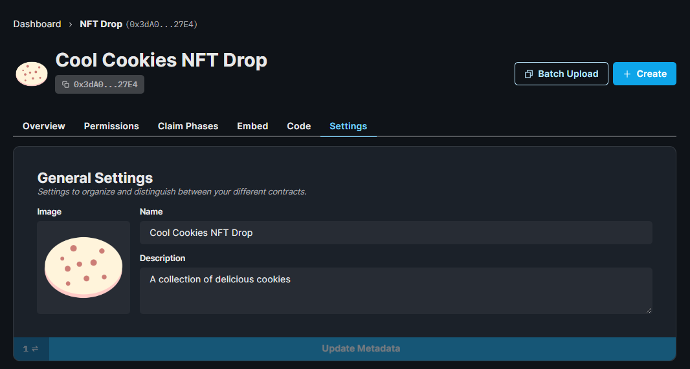

import QuickstartCard from "../../../../../src/components/QuickstartCard";

# Configurando Contratos Inteligentes

Cada contrato que você cria inclui configurações como:
[metadados](/sdk/advanced-features/contract-settings#contract-metadata),
[permissões](/sdk/advanced-features/permission-controls), and
[royalties (ou direitos autorais)](/sdk/advanced-features/contract-settings#royalty-fees);
para um controle detalhado sobre o seu contrato.

Esta página irá mostrar como você pode deixar seu contrato pronto para ser enviado para produção!

## Metadados e Royalties

Metadados incluem informações como a imagem, nome, símbolo e a descrição do contrato em sí.
Estas informações serão exibidas automaticamente em websites como o OpenSea e o Rarible assim que você configurar o seu contrato.

Abaixo está um exemplo de como configurar metadados para o seu contrato na aba **Settings** do **Dashboard**:

Na mesma aba, você também pode configurar os _royalties_ para o seu contrato; que são taxas que você irá receber das vendas secundárias dos NFTs.
1

## Adicionando Membros ao Time

Se você está trabalhando em um time, você pode convidar carteiras ao seu contrato, com diferentes níveis de permissões; como
administrador (`admin`) ou criador (`creator`). Saiba mais sobre os diferentes papéis e o que eles podem fazer nas informações abaixo:

  

    <QuickstartCard
      name="Controle de Permissões dos Contratos"
      link="/sdk/advanced-features/permission-controls"
      image="/assets/icons/teams.png"
    />
  

Você simplesmente irá informar o endereço da carteira que você deseja convidar, e então clique em **Update Permissions**!

Agora que você tem o seu contrato configurado, vamos aprender como você pode criar NFTs nele!

  

    <QuickstartCard
      name="Criando e Disponibilizando NFTs"
      link="/getting-started/creating-nfts"
      image="/assets/icons/drop.png"
    />
  

