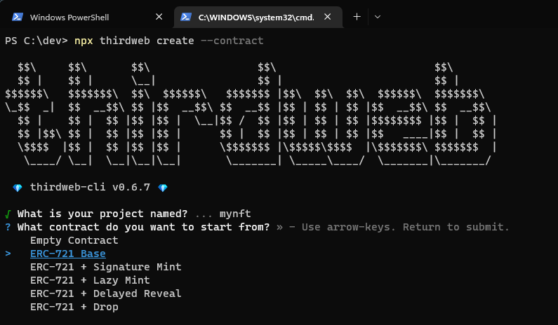

import QuickstartCard from "../../../../../src/components/QuickstartCard";

# Criando Contratos Customizados

Todos os elementos individuais que compõem nossos contratos pré-configurados estão disponíveis nas [Extensões](/extensions),
para que você monte juntas as várias partes dos nossos contratos e customizá-los para que você construa o seu próprio!

Esta página mostrará como criar e disponibilizar a sua própria coleção NFT usando o padrão [ERC721A](https://www.erc721a.org/).

## Criando um Contrato Customizado

Primeiro, podemos usar o [CLI](https://github.com/thirdweb-dev/thirdweb-cli) para criar um novo projeto com um contrato inteligente dentro, e [Extensões](/extensions) instaladas para nós.

```bash
npx thirdweb create --contract
```

Usando o CLI, podemos simplesmente selecionar o contrato base que desejamos para começar. Vamos selecionar o modelo [ERC721Base](/extensions/base-contracts/erc-721/erc721base):



### Iniciando à partir de um Contrato Base

Uma vez que o projeto foi inicializado, você poderá abri-lo no seu editor de texto e ver o código do contrato.

Contratos Base nos dão um ótimo ponto de partida com funcionalidades que já foram implementadas para nós.

Você poderá notar que para um contrato "iniciar" como um Contrato Base, como um contrato [ERC721Base](/extensions/base-contracts/erc-721/erc721base), precisaremos:

1. Importar o contrato à partir do SDK.
2. Herdar o contrato, por declarar que `MyNFT is ERC721Base`.
3. Implementar qualquer dos [métodos obrigatórios](/extensions/base-contracts/erc-721/erc721base#implementing-the-contract-extension) como por exemplo o `constructor`.

```solidity title="MyNFT.sol"
// SPDX-License-Identifier: MIT
pragma solidity ^0.8.0;

import "@thirdweb-dev/contracts/base/ERC721Base.sol";

contract MyNFT is ERC721Base {
      constructor(
        string memory _name,
        string memory _symbol,
        address _royaltyRecipient,
        uint128 _royaltyBps
    )
        ERC721Base(
            _name,
            _symbol,
            _royaltyRecipient,
            _royaltyBps
        )
    {}
}
```

### Adicionar as Extensões do Contrato

Contratos Base funcionam automaticamente sem a necessidade de nenhum código adicional, mas você pode desejar adicionar funcionalidades específicas ao seu contrato.
Para fazer isso, você poderá escrever qualquer lógica customizada ou 
começar implementando extensões de contrato adicionais; como [Permissões](/extensions/features/permissions) por exemplo,
seguindo o mesmo padrão que este contrato segue.

**1. Importar o contrato à partir do SDK.**

```solidity
import "@thirdweb-dev/contracts/extension/PermissionsEnumberable.sol";
```

**2. Herdar o contrato, por declarar que `MyNFT is ERC721Base`.**

```solidity
contract MyNFT is ERC721Base, PermissionsEnumberable {
    // ...
}
```

**3. Implementar qualquer dos [métodos obrigatórios], como por exemplo o `constructor`.**

```solidity
// SPDX-License-Identifier: MIT
pragma solidity ^0.8.0;

import "@thirdweb-dev/contracts/base/ERC721Base.sol";
import "@thirdweb-dev/contracts/extension/PermissionsEnumerable.sol";

contract MyNFT is ERC721Base, PermissionsEnumerable {
      constructor(
        string memory _name,
        string memory _symbol,
        address _royaltyRecipient,
        uint128 _royaltyBps
    )
        ERC721Base(
            _name,
            _symbol,
            _royaltyRecipient,
            _royaltyBps
        )
    {
        // Dá ao disponibilizador do contrato o perfil de "admin" quando o contrato é disponibilizado.
        _setupRole(DEFAULT_ADMIN_ROLE, msg.sender);
    }
}
```

## Próximos Passos

Agora que temos nosso contrato escrito, vamos compartilhá-lo com o resto do mundo!

Na sequência, vamos aprender como usar o `CLI` para criar uma **release** versionada do nosso contrato, e então fazer o **deploy** dele à partir do _Dashboard_.

<div className="row" style={{ marginBottom: 24 }}>
  <div className="col col--12" style={{ marginTop: 8 }}>
    <QuickstartCard
      name="Disponibilizando & Instalando Contratos Customizados"
      link="/getting-started/releasing-custom-contracts"
      image="/assets/icons/sdks.png"
    />
  </div>
</div>
